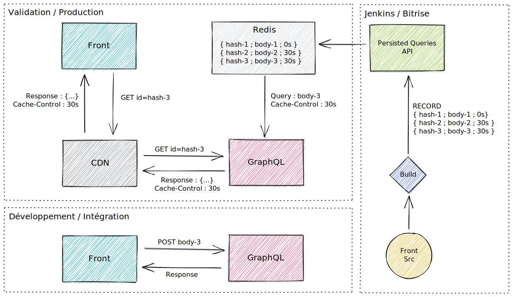

## Avant propos
La performance est un sujet critique pour MYTF1. Lors de grands évènements tels que la coupe du monde de football ou de la diffusion de programmes fédérateurs comme The Voice ou Koh-Lanta, le service doit tenir la charge face à plusieurs centaines de milliers d'utilisateurs simultanés qui peuvent se connecter à seulement quelques minutes d'intervalle pour, par exemple, suivre un live. Il nous faut alors trouver des solutions techniques pour absorber ces pics de trafic. L'une d'entre elle réside en l'utilisation de caches que nous allons vous décrire dans cet article.

## La gestion du cache
Sur MYTF1 nous manipulons deux grandes catégories de données, celles dites publiques (le catalogue de contenu) et celles dites privées (liées à l'utilisateur). De par leur nature différentes, nous sommes obligés d'adopter des stratégies de mise en cache adaptées à chacune d'entre elles.

### Les niveaux de cache
Pour tenir la charge, différents niveaux de caches sont utilisés:

- le cache client [Apollo](https://www.apollographql.com/), permet d'avoir un cache cohérent au niveau d'un front pour un utilisateur (données privées et publiques)
- les CDN ([cloudfront](https://aws.amazon.com/cloudfront/)) permettent de mettre en cache les données publiques et le flux vidéo coté backend
- les bases de données [Redis](https://redis.io/) permettent de stockée les sessions utilisateurs (avec leur données privées) ou d'avoir une vision dénormalisée des données publiques (répliquées depuis le CMS)

### GraphQL et les persisted queries
Historiquement, MYTF1 s'appuie beaucoup sur le cache des CDN. En effet, une grande partie des données sont publiques, notamment toutes les informations liées au catalogue vidéo. Avec GraphQL il n'est pas naturel d'utiliser ce type de cache. Par nature, la combinatoire des requêtes et le fait de pouvoir mélanger données privées et publiques ne permet pas de cacher.

Nous avons réutilisé la mécanique de *persisted queries* d'Apollo que nous avons légèrement modifiée. Celle-ci consiste à sauvegarder le corps dez requêtes dans une base de données. Le client Apollo n'envoit qu'un ID (en général un hash du corps de la requête) dans une requête GET pour intérroger le GraphQL. Ce dernier récupére alors le corps de la requête associé à cet ID puis procéde à son exécution. De cette façon il est plus simple de mettre en place du cache CDN. Ce fonctionnement est activé en production, sur les environnements de developpement il reste desactivé pour garder toute la souplesse de GraphQL. Les corps des requêtes sont sauvegardés en base de données au moment du build par notre CI/CD.

Les avantages sont les suivants:

- le GraphQL est vérouillé en production, on ne peut pas explorer le schema avec des requêtes non présentes dans le code
- le GraphQL n'est pas vérouillé sur les environnment hors production, on garde donc toute la souplesse de l'API pour les developpeurs
- les requêtes publiques sont connues à l'avance et associées à un TTL qui est transmis dans un header [Cache-Control](https://developer.mozilla.org/fr/docs/Web/HTTP/Headers/Cache-Control) et donc exploité par les CDN
- réduction des payloads des requêtes (le front n'envoyant plus qu'un ID par appel)

Côté serveur, comme nous utilisons une implémentation Go de GraphQL (et non la stack serveur Apollo), nous avons dû réimplémenter toute cette mécanique de gestion des *persisted queries* et en avons profité pour l'adapter à nos besoins.

### Le cache de données privées
Il est necessaire, pour exploiter efficacement le cache, de séparer les requêtes qui contiennent des données privées. Une partie de l'intelligence est déportée sur le front. Par exemple, la liste des programmes mis en favoris par un utilisateur est récupérée en début de session. Les écrans sont ensuite construits à partir des données publiques, les favoris précédemments récupérés viennent les enrichir en affichant un coeur sur les vignettes des programmes concernés. Cette logique est plus complexe mais garantit qu'en cas d'indisponibilité du backend, le front pourra toujours afficher un écran en mode dégradé (ne contenant que des données publiques) à partir du *stale cache* CDN.

Nous nous appuyons également sur des caches Redis. À la connexion d'un utilisateur, toutes ses données sont stockées sous forme d'une session dans le cache. Les appels suivants sont alors moins couteux (il n'est plus nécessaire d'aller récupérer les données en base, le cache les contenant déjà).

Enfin, l'utilisation d'un token JWT permet d'identifier un utilisateur sans sollicitation d'un service ou d'une base de données. Le token est transmis par le front au GraphQL puis aux micro services sous jacents. Ces derniers peuvent alors vérifier eux même la validitée du token (par simple vérification de la signature) et ainsi déterminer quel utilisateur est à l'origine de la requête.

## Conclusion
Comme nous l'avons vu dans cet article, la gestion du cache est centrale pour un service à fort trafic commme MYTF1. Plusieurs stratégies de mise en cache ont été mises en place dans le but de satisfaire deux grands objectifs : la performance et la résilience. Les choix que nous avons effectués s'avèrent être payants. Aujourd'hui MYTF1 est capable d'absorber de fortes charges sans dégradation notable des performances. Il est important de noter que les choix que nous avons faits sont pertinents dans notre contexte mais peuvent l'être beaucoup moins dans d'autres. Il convient de faire des choix adaptés à chaque sitation, notre *recette* n'est pas une solution miracle. Cependant, nous espérons qu'elle pourra vous inspirer et éventuellement vous aider dans les décisions à prendre pour vos projets respectifs.