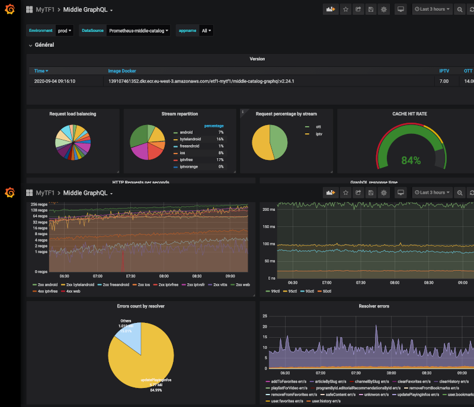

# MYTF1 quésaco ?

[MYTF1](https://www.tf1.fr/) est le service de replay du [groupe TF1](https://www.groupe-tf1.fr). Il permet à nos utilisateurs de voir ou revoir en streaming les programmes des chaînes suivantes : [TF1](https://www.tf1.fr/tf1), [TMC](https://www.tf1.fr/tmc), [TFX](https://www.tf1.fr/tfx), [TF1 Séries Films](https://www.tf1.fr/tf1-series-films) et [LCI](https://www.lci.fr/). Il est disponible sur la plupart des écrans: Web, Mobile (iOS, Android) et sur les box des principaux opérateurs (IPTV). Ce service gratuit tire principalement ses revenus de la publicité.

MYTF1 englobe un large spectre de sujets :

- le streaming vidéo et l'encodage des contenus
- le ciblage de la publicité
- la recommendation de contenu (la data)
- l'animation des contenus (l'éditorialisation)
- la gestion des données utilisateurs (historique de lecture, mise en favoris, etc...)

# Les technos utilisées

MYTF1 existe depuis 2011 et a été depuis plusieurs fois refondu from scratch.

| Période            | Technos                                              |
| ------------------ | ---------------------------------------------------- |
| 2011 - 2015        | PHP, MySQL                                           |
| 2015 - 2019        | NodeJS, PostgreSQL                                   |
| 2019 - Aujourd'hui | Go, GraphQL, gRPC, MongoDB, Kafka, Redis, Kubernetes |

## Backend

Aujourd'hui le backend est constitué d'un ensemble de micro-services écrits en [Go](https://golang.org). Après la période [NodeJS](https://nodejs.org/), nous avons décidé de retourner à un language fortement typé. La façon dont Go gère la concurrence (go routine) permet de tenir le fort traffic de MYTF1 et est particulièrement adapté a un écosysteme **kubernetes** :

- emprunte mémoire faible
- démarrage rapide (binaire compilé)
- taille des images docker réduite
- idéal pour des services HTTP / [gRPC](https://grpc.io)

C'est également un language rapide à apprendre.

### GraphQL

L'API [GraphQL](https://graphql.org) est une brique centrale pour MYTF1. Nous l'utilisons comme source de données des différents fronts. Les avantages sont les suivants :

- pas de service spécifique par écran, chaque front peut requêter ce dont il a besoin uniquement
- le GraphQL joue le rôle d'API gateway, c'est lui qui rassemble les données des micro-services sous jacents
- contrat d'interface auto documenté entre le back et les fronts

### Les bases de données

Nous utilisons [MongoDB](https://www.mongodb.com) et [PostgreSQL](https://www.postgresql.org) pour les bases de données de référence.
Ces données sont ensuite dénormalisées dans des cluster [Redis](https://redis.io). Nous avons adopté une architecture "event driven" en nous appuyant sur [Kafka](https://kafka.apache.org) pour maintenir une synchronisation constante entre ces bases de données.

## Web

Le front MYTF1 repose sur une SPA en [Reactjs](https://fr.reactjs.org) et un serveur expressjs pour le SSR (server side rendering) pour assurer un bon référencement. Nous utilisons react car la partie SSR est éprouvée ainsi que le large écosystème open source.

### Applicatif front :

La stack est principalement axée sur les performances et le SEO. React via React-dom/server permet de généré du HTML cote serveur qui sera ensuite "hydrater" cote client pour assurer une bonne UX.

**TypeScript :**
Nous utilisons fortement [Typescript](https://www.typescriptlang.org) pour que l'appropriation du code soit rapide, de plus, et comme tests "statiques" pour s'assurer que l'on envoie bien le bon type de données aux fonctions

**GraphQL & Apollo :**
[Apollo](https://www.apollographql.com) nous permet de consommer l'API GraphQL et fonctionne aussi cote serveur.
Via GraphQL code generator, on genere toute nos composants/hooks Apollo via nos queries/mutations en typescript, ce qui permet encore une fois de s'assurer que ces requêtes sont valides.

**Helmet :**
[Helmet](https://github.com/staylor/react-helmet-async) est la librairie (react-helmet-async et non pas react-helmet) nous permet d'enrichir au fur et a mesure des composants rendu les balises metas qui aident a la compréhension des robots de moteurs de recherches du contenu de nos pages.

### Performance et Qualité :

**Webpack & Lazyloading :**
_brouillon : Nous utilisons [Webpack](https://webpack.js.org) pour nos ressources statiques…( modules, chunk...), (code splitting) splitter nos builds en plusieurs paquets, chargé à la demande (à compléter ....)_

**Jest / React Testing Library :**
Nous utilisons [Jest](https://jestjs.io) pour nos tests unitaires, ce qui nous permet de vérifier la non-régression du front MYTF1, tout au long du développement de nos features et de garantir la fonctionnalité de composants complexes.

## APP

Les applications mobiles sont natives et codées en [Swift](https://swift.org) (iOS) et [Kotlin](https://kotlinlang.org) (Android) implémentant une architecture modulaire multi couches.

**Couche Networking:**
Un client GraphQL [Apollo](https://github.com/apollographql/apollo-ios) intégré dans l'application nous permet de consommer l'API backend GraphQL.

**Couche Core:**
Couche contenant la logique métier et les modèles utiliser dans l'application.

**Couche Présentation:**
Implémentant une architecture MVI unidirectionnel qui représente une évolution de l'architecture MVVM avec des bindings en RxSwift & RxJava. Les avantages d'une telle architecture est un flux de données plus facile à suivre et à debugger.

## IPTV

Les techno utilisées sur l'iptv sont très variées et dépendent du modèle de box, globalement on retrouve trois familles:

- **HTML/JS**, principalement SFR et Orange
- **QT/QML**, très utilisé par Free
- **Android**, notamment sur Bouygues et Free

Dans le cas des box Android, un moteur QT/QML tourne dans l'application afin de réutiliser le code QT/QML.

## Le player

Nous developpons notre propre player pour différentes plateformes :

- le Web (JS)
- iOS (Swift)
- Android (Kotlin) pour les applications mobiles et certaines box opérateur

TODO a voir avec Guillaume

## Le CMS

Nous avons également développé un CMS maison qui permet à l'équipe édito d'animer le contenu de MYTF1. Il est développé en [Vue.js](https://vuejs.org).

# L'architecture backend

## Event driven

TODO un schéma de l'archi globale + explication event driven

# La performance et la QOS

La performance est un sujet critique pour MYTF1. Lors de grands évènements tels que la coupe du monde de football ou de la diffusions de programmes fédérateurs comme The Voice ou Koh-Lanta, le service doit tenir la charge face à plusieurs centaines de milliers d'utilisateurs simultanés qui peuvent se connecter à seulement quelques minutes d'intervalle pour, par exemple, suivre un live.

## La gestion du cache

### Les niveaux de cache

Pour tenir la charge, différents niveaux de caches sont utilisés:

- le cache apollo, permet d'avoir un cache cohérent au niveau d'un front pour un utilisateur (données privées et publiques)
- les CDN ([cloudfront](https://aws.amazon.com/cloudfront/)) permettent de mettre en cache les données publiques et le flux vidéo coté backend
- les base de données Redis permettent de mettre en place une session pour les données privées ou d'avoir un vision dénormalisée des données publiques

### GraphQL et les persisted queries

Historiquement, MYTF1 s'appuie beaucoup sur le cache des CDN. En effet, une grande partie des données sont publiques, notamment toutes les informations liées au catalogue vidéo. Avec GraphQL il n'est pas naturel d'utiliser ce type de cache. Par nature, la combinatoire des requêtes et le fait de pouvoir mélanger données privées et publiques ne permet pas de cacher.

Nous avons réutilisé la mécanique de "persisted queries" d'apollo que nous avons légèrement modifiée. Celle-ci consiste à sauvegarder le body de la requête dans une base de données. Le client apollo n'envoit qu'un ID (en général un hash du body de la requête) dans une requête GET pour intérroger le GraphQL. De cette façon il est plus simple de mettre en place du cache CDN. Ce fonctionnement est activé en PROD, sur les environnements de developpement il reste desactivé pour garder toute la souplesse de GraphQL. Les body des requêtes sont sauvegardés en base de données au moment du build par notre CI/CD.

Les avantages sont les suivants:

- le GraphQL est vérouillé en PROD on ne peut pas explorer le schema avec des requêtes non présentes dans le code
- le GraphQL n'est pas vérouillé sur les environnment hors PROD, on garde donc toute la souplesse de l'API pour les developpeurs
- les requêtes publiques sont connues à l'avance et associées à un TTL qui est transmis dans un header Cache-Control et donc exploités par les CDN

### Le cache de données privées

Il est necessaire, pour exploiter efficacement le cache, de séparer les call qui présentent des données privées. Une partie de l'intelligence est déportée sur le front. Par exemple, la liste des vidéo mises en favoris par un utilisateur, est récupérée en début de session. L'écran est construit à partir des données publiques, les favoris précédemments récupérés viennent enrichir l'écran, en affichant un coeur sur la vignette vidéo. Cette logique est plus complexe mais garanti que même lors d'une indisponibilité du backend, le front pourra afficher un écran dans un mode dégradé (à partir du stale cache CDN).

<!--more-->

Nous nous appuyons également sur des cache Redis, en début de sessions, les données d'un utilisateur sont remontées dans ce type de cache, les call ultérieurs sont alors moins couteux.

<!--more-->

Enfin, l'utilisations d'un token JWT, permet d'identifier un utilisateur sans sollicitation d'un service ou d'une base de données, le token est transmis du GraphQL aux micro services sous jacents qui peuvent alors vérifier eux même la validitée du token (par simple vérification de la signature).

## Le monitoring

Nous utilisons l'outil [Grafana](https://grafana.com), associé à [Prometheus](https://prometheus.io), pour faire le monitoring de nos applicatifs et de notre infrastructure. [Graylog](https://www.graylog.org) permet quand à lui de récupérer les logs d'execution. Nous enviseagons d'utiliser [Jaeger](https://www.jaegertracing.io) qui permettrait de restituer une vision cohérente des services en terme de monitoring et de logs.

# La vidéo
La vidéo est un domaine assez large, avec pas mal d'acronymes et de formats exotiques. Nous allons y aller progressivement 😉
## Plusieurs types de vidéos et modes de diffusion
Nous distinguons 2 types de vidéos:
- les flux live (chaines TF1, TMC, TFX, TF1 Séries Films, LCI et lives évenementiels) qui proviennent d'un _encodage_ en temps réel d'un flux vidéo "broadcast" vers un format de diffusion vidéo "informatique". Nous appelerons cette partie "live"
- les replays, extraits, spots publicitaires et bonus digitaux que nous regrouperons ici sous l'appelation "replay", et qui subissent des _transcodages_ vers différents formats pour les différents écrans de diffusion (dont les capacités varient)
MYTF1 diffuse de la vidéo de 2 manières différentes:
- en OTT (_over-the-top_, terme consacré pour la diffusion via Internet) via notre infrastructure ou des services tiers que nous payons (CDN - Content Delivery Networks). Ici notre enjeu est d'offrir la meilleure expérience au plus grand nombre, en terme de qualité visuelle, de latence et d'accessibilité, tout en minimisant nos coûts de diffusion, sans oublier la protection des contenus des ayants droit.
- via des partenaires qui assurent l'éventuel transcodage et la diffusion (IPTV - portails des box - et Salto).
Au niveau des formats de diffusion OTT, nous supportons les formats suivants:
- HLS ("HTTP Live Streaming", sur apps iOS et Safari Mobile)
- DASH ("Dynamic Adaptive Streaming over HTTP", sur le reste)
- MP4 (pour les courts spots de pub des replays)
HLS et DASH sont des formats de diffusion adaptés à la diffusion sur Internet: la vidéo est transcodée en différentes qualités et segmentée en bouts de quelques secondes, ce qui permet au player de s'adapter en cours de visionnage en téléchargeant la qualité la plus appropriée à sa capacité actuelle de téléchargement.
Pour la protection contre la copie, nous utilisons sur les replays en DASH les DRM Widevine (DRM Google: players sous Chrome, Firefox, Android ...) et Playready (DRM Microsoft, donc players sous Edge) et sur les replays en HLS la DRM Fairplay (Apple)
Les différents formats possibles pour une vidéo ne sont pas stockés de manière permanente, ils sont générés à la demande et mis en cache.
Au niveau des formats de compression OTT, nous utilisons le codec H.264 pour la vidéo, et le codec AAC pour l'audio.
## Plusieurs activités dans la gestion de la vidéo
La vidéo chez MYTF1 peut se décomposer en 2 grandes parties:
### Gestion des métadonnées live et replay (titre, résumé, dates de diffusion antenne et/ou de disponibilité sur MYTF1, ...) et des mises en ligne
- un backoffice éditorial de commande de "replay" (développé en interne)
- mise à disposition de ces informations aux autres services de MYTF1 et aux partenaires via différentes API et files de messages
- services pour les players (récupération des métadonnées et de l'URL de diffusion, protection de certains contenus via DRM - Digital Rights Management)
### Gestion des données vidéo live et replay
- ingestion (encodage/transcodage, gestion des sous-titres éventuels, packaging - préparation à la diffusion OTT)
- envoi aux partenaires, pour les vidéos (le live IPTV est géré par TF1)
- diffusion OTT (génération des formats HLS/DASH/MP4 éventuellement DRM-isés, caches, transit entre notre datacenter et les FAI, CDN)
La partie cache et transit est primordiale pour nos maîtrise des coûts de diffusion, afin d'utiliser le moins possible les services de CDN.
C'est pour cela qu'il doit être rapide de basculer la diffusion vidéo d'un point vers un autre, en fonction des besoins.
## Architecture
(insérer schéma high-level ici)
## Technos utilisées dans la vidéo
Une grande partie de nos services est développée en interne grâce à des projets OpenSource, mais nous avons recours à des systèmes propriétaires pour certains aspects très techniques (encodage/transcodage, packaging et génération à la volée des différents formats)
### Dans la partie métadonnées
Le service MOVE ("Outil Vidéo Multi-Ecrans"), qui est notre backoffice de commande de replays, de découpe d'extraits et de livraison aux partenaires, est écrit en PHP/Symfony avec du MySQL derrière (oui, il vit depuis quelques années).
Le service de réferentiel vidéo, qui regroupe toutes les métadonnées des vidéos, a une API écrite en NodeJS et une autre en Go. Son stockage primaire est une base Postgresql (avec utilisation de champs JSON)
Le système de notifications de changement de métadonnées est architecturé autour de RabbitMQ.
Les services de mises à jour des métadonnées vidéo coté publicité sont écrits en Go.
Le service de métadonnées vidéo (mediainfo) appelé par les players est écrit en Go.
Au niveau DRM, nous avons le service Widevine et le service Fairplay qui sont écrits en Go, et le service Playready qui est écrit en C# (car SDK .NET)
### Dans la partie vidéo proprement dite
Le pilotage des transcodages est effectué par un outil (videoworkflow), écrit en Go et s'appuyant sur RabbitMQ.
Les transcodeurs sont des Elemental Server. Ce sont des serveurs propriétaires avec des GPU pour accélérer les traitements. Ils disposent d'un backoffice web et d'une API REST, par lesquels on peut créer des profils d'encodage et soumettre des jobs.
Le système de génération à la demande des différents formats vidéo, avec gestion des DRM et des sous-titres, est également propriétaire, de chez Unified Streaming.
Nos caches sont basés sur l'excellent serveur Web nginx, avec des serveurs physiques gavés de RAM et de disque.

# Le cloud et le devops

Nos services sont déployés sur des clusters kubernetes. Nous utilisons le cloud [AWS](https://aws.amazon.com/) pour héberger ces clusters (service [EKS](https://aws.amazon.com/eks/)).

## L'infra as code

TODO AWS + Terraform

## L'auto scaling

TODO fonctionnement + explication linkerD

## La CI/CD

TODO explication jenkins + tests non reg / replayer + spinnaker
