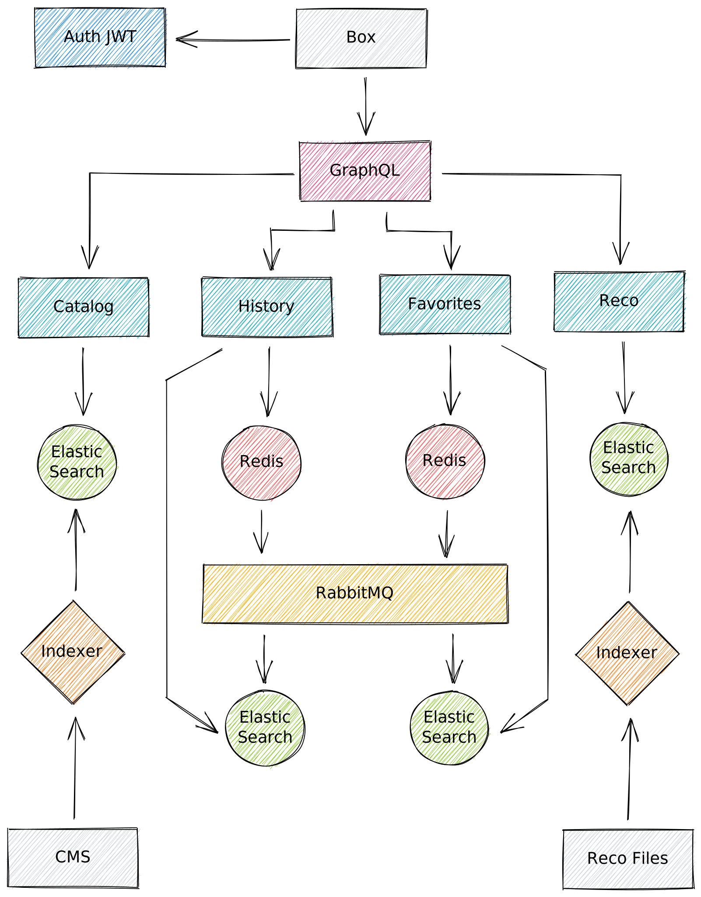

## Qui sommes nous ?

Intégrée au sein de e-TF1 (antenne digital du groupe TF1) l’équipe backend a pour objectif de répondre aux problématiques suivantes :
- Gérer la mise en ligne et l’animation éditoriale de notre contenu
- Stocker et restituer les données utilisateurs (historique et progression de lecture, programme favoris, bookmakrs etc..)
- Exporter/partager notre catalogue de contenu avec nos partenaires (FAI, Salto, etc...)
- Fournir des API aux fronts pouvant supporter de fortes charges

Elle est composée d’une dizaine de personnes ayant des profils (développeur, product owner, lead tech, internes ou externes) et des niveaux d’expérience (débutant, expérimenté, stagiaire, alternant) différents. Depuis 2018 nous avons fait le choix d’investir fortement dans le langage Go qui représente aujourd’hui la quasi intégralité de notre base de code.

## Architecture et technologies

Nous avons fait le choix d’une architecture micro-services. Les différentes composantes métier sont réparties en services dédiés, qui communiquent principalement via GRPC.
Voici une liste non exhaustives de nos briques métier :
- CMS API : dédiée à l’animation éditoriale de notre contenu
- Catalog API : dédiée à la gestion de notre catalogue de contenu
- User API : dédiée à la gestion des données utilisateur
- Reco API : dédiée à la recommandation de contenu
- SEO API : dédiée  aux problématiques SEO
- Auth API : dédiée à l’identification de nos utilisateurs

Pour les applications MYTF1, nous avons fait le choix d’exposer à travers une API GraphQL une vision consolidée de ces services.
En effet, l’API GraphQL agit comme une API Gateway et se charge d’exposer un modèle de données cohérent et unifié qui répond aux besoins exprimés par les équipes produit/métier.
Elle a été conçue et créée avec une vision multi-écran et doit être capable de fonctionner aussi bien pour nos applications Web, que pour les applications mobiles ou encore les box opérateurs.

Pour répondre aux différents challenges qui nous sont adressés, nous avons choisies les technologies suivantes : 
- Langages : [Go](https://golang.org/), [Java](https://www.java.com/)
- Base de données : [MongoDB](https://www.mongodb.com/), [Elasticsearch](https://www.elastic.co/), [DynamoDB](https://aws.amazon.com/dynamodb/), [Redis](https://redis.io/)
- Event/Message broker : [RabbitMQ](https://www.rabbitmq.com/), [Kafka](https://kafka.apache.org/)
- Frameworks Fronts : [Vue.js](https://vuejs.org/), [React](https://reactjs.org/)
- Formats des API : [GRPC](https://grpc.io/), [GraphQL](https://graphql.org/), [Rest](https://fr.wikipedia.org/wiki/Representational_state_transfer)
- Infrastructure : [AWS](https://aws.amazon.com/), [Kubernetes](https://kubernetes.io), [Docker](https://www.docker.com/), [Linkerd](https://linkerd.io/)
- Monitoring : [Prometheus](https://prometheus.io/), [Grafana](https://grafana.com/)
- CI/CD : [Jenkins](https://www.jenkins.io/)

Cette liste, bien que fournies, peut-être amenée à évoluer en fonction des futurs besoins ou challenges qui se présenteront.
En effet, une des forces de l’équipe et de savoir se remettre en question et faire table rase du passée. C’est ce que nous allons voir dans le paragraphe suivant.

## Un peu d’histoire

### 2018 : Nouvelle expérience IPTV

Début 2018 MYTF1 se lance dans un projet radical de transformation de l’expérience utilisateur sur les box opérateurs (IPTV).
Un cahier des charges est définit et de nouveaux enjeux apparaissent :
- Permettre une navigation fluide du contenu
- Possibilités d’éditorialisation avancées
- Recommandation de contenu personnalisée
- Gestion de l’historique et de la reprise de lecture
- Mise en favoris des programmes

À ce stade, nous sentons bien que le socle technologique existant a atteint ses limites et qu’il faut envisager des changements radicaux.
Une petite équipe est montée pour relever ce défi. Elle deviendra plus tard l'équipe Backend.

Nous ferons alors plusieurs choix structurants :
- Mise en place d’une API GraphQL pour exposer les données au front
- Utilisation de cache in-memory au niveau de l'API GraphQL
- Découpe des différents besoins en micro-services GRPC dédiés
- Dénormalisation des données catalogue et éditoriales dans elasticsearch
- Gestion de la session utilisateur dans redis
- Ecriture asynchrone des données utilisateur
- Utilisation d’un token JWT pour identifier l’utilisateur

Dès le début, même si le projet est centré sur l’IPTV, nous avons la volonté de créer un nouveau socle technique qui sera capable d’adresser tous les écrans (Web et applications mobiles compris).
En effet, à date, il n’y a pas réellement de socle commun et chaque écran est traité séparément (avec ses propres solutions, technologies et choix techniques).
Nous avons toujours garder cette idée dans un coin de nos têtes et elle a piloté beaucoup de nos décisions.

S’en suit alors une phase intensive de conception et développement, en effet les délais sont serrés (mise en production attendue pour Juin 2018) et nous avons beaucoup de travail à abattre (autant côté back que côté front).
L'application sera finalement lancée en Juillet 2018, pour les utilisateurs de freebox.

La première mouture de notre nouvelle architecture backend est enfin prête :

Concrétement, nous avons deux sources de données principales, le CMS et les fichiers de recommandation (au format [Parquet](https://parquet.apache.org/)). Via des indexeurs, nous dénormalisons régulièrement ces données dans des bases Elasticsearch qui sont ensuite exposées via des API GRPC dédiées (Catalog et Reco sur le schéma). Pour les données utilisateur, elles sont également stockées dans des bases Elasticsearch. Lorsqu'un utilisateur se connecte, les données qui lui sont associées sont copiées dans des instances redis qui agissent comme un cache de session. Toutes les écritures sont maintenues à jour de manière synchrones dans Redis puis propagées de manière asynchrone vers nos bases Elasticsearch via des notifications RabbitMQ.
Les données utilisateurs sont accessibles via des API GRPC dédiées (History et Favorites sur le schéma). Au dessus de ces services nous avons notre API GraphQL qui se chargent d'unifier les données des différentes briques et en exposer une vision consolidée aux fronts (les box opérateurs dans le cas présent). Pour l'identification des utilisateurs, nous avons fait le choix du token JWT. Un service dédié se charge de générer un token (sur demande du front) qui est ensuite propagé dans tous les appels GraphQL puis vers les services concernés (History et Favorites par exemple). Ainsi nous pouvons facilement identifier l'utilisateur à l'origine de la requête et retrouver, par exemple, son historique de lecture.

Niveau infrastucture, toutes nos applications sont packagées sous forme d'image Docker qui sont ensuite déployées sur notre cluster Kubernetes maison (géré par notre équipe OPS). À ce stade, nous avions également fait le choix de ne pas utiliser de cache HTTP entre les box et le GraphQL. En effet les réponses mélangent à la fois données publiques (ex : catalogue) et privées (ex : historique de lecture) et se prêtent donc mal à l'exervice. Seule solution, faire en sorte de tenir la charge en dimenssionnant correctement notre infrastructure (phase de bench) et en optimisant les applications (en utilisant, par exemple, des caches in-memory côté GraphQL pour les données publiques).

Un deuxième jalon important marquera l'année 2018, avec la mise à disposition de notre nouvelle application IPTV sur les box Android de Bouygues Telecom. Mais pour nous, ce n'est que le début...

### 2019 : Du grand aux petits écrans

Mi-2018, émerge chez e-TF1 l'envie de refondre les applications MYTF1 web et mobile. Au delà de l'aspect esthétique il y a une véritable volontée de repenser le produit et le recentrer autour d'axes stratégiques précis. Le second semestre 2018 est mis à profit pour définir précisément les contours de ce nouveau produit. Au terme de cette réflexion plusieurs priorités sont définies :
- Un nouveau design pour les applications web et mobile
- Une expérience de lecture vidéo irréprochable
- Mettre la personnalisation au centre de l'expérience MYTF1
- Améliorer les outils d'éditorialisation
- Proposer une nouvelle offre de contenus (AVOD)

