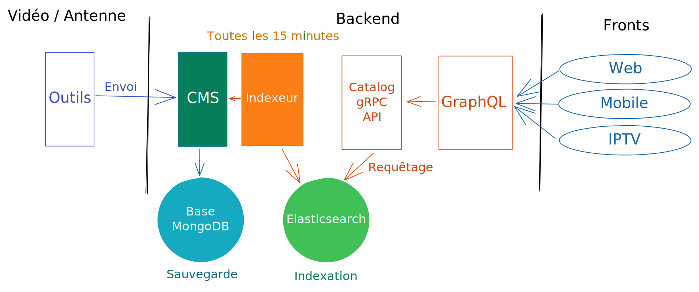

## Historique

Comme vous avez pu le découvrir sur notre article [Tour d'horizon technique](/post/2020/architecture/presentation/), notre stack backend est chargée d'exposer les données aux différents fronts.

Chez MYTF1, la partie contenu vidéo est gérée par une équipe dédiée. Son rôle est de faire le lien entre l'antenne (les chaines de télévision) et la plateforme de diffusion de MYTF1.
Pour ce faire, l'équipe vidéo récupère différentes données en provenance de l'antenne (les fichiers vidéos, les sous-titres, les méta-données, etc.), les convertit dans des formats compatibles avec les différents modes de diffusion proposés par MYTF1 (voir [l'article dédié](/post/2020/architecture/video/)) puis consolide le tout dans un référentiel interne.

Le rôle de l'équipe backend est d'**éditorialiser et transformer les données de ce référentiel** afin qu'elles soient exploitables par nos différents fronts digitaux (Web, Mobile et IPTV) via notre gateway GraphQL.

Jusque là, notre architecture ressemblait à la suivante :

Globalement, après récupération des données fournies par l'équipe vidéo, nous les stockons dans la base [MongoDB](https://www.mongodb.org) dédiée au CMS qui se charge ensuite de les éditorialiser.

La suite du workflow est déclenchée par notre job nommé "Indexeur" (exécuté périodiquement, toutes les 15 minutes) qui, comme son nom l'indique, va s'occuper de l'**indexation** mais aussi de la **transformation** des données stockées dans le CMS afin qu'elles soient pré-formatées pour les besoins des différents fronts.

Une fois stockées dans le moteur [Elasticsearch](https://www.elastic.co/fr/elasticsearch/), lorsqu'un front fait un appel à notre gateway GraphQL, celle-ci contacte une API gRPC (Catalog API sur le schéma) qui va s'occuper de récupérer les données Elasticsearch et de les formatter sous forme d'objets Protobuf bien définis à GraphQL. Les résolveurs GraphQL s'occupent ensuite d'exposer ces objets aux fronts.

Cette mécanique fonctionne correctement et est même résiliente car en cas de soucis sur notre brique d'indexation, elle permet de ne pas impacter les fronts qui disposeront toujours de la dernière version à jour.

Cependant, principalement pour des besoins d'éditorialisation, nous souhaitions supprimer ces 15 minutes d'attente entre chaque indexation et avoir un workflow davantage **temps réel** et [event-driven](https://en.wikipedia.org/wiki/Event-driven_programming). Ainsi les modifications effectuées par nos équipes édito seront mises en ligne beaucoup plus rapidement (après quelques secondes). Cette approche event-driven nous offrira également de nombreuses possibilités dans le futur, comme réagir aux actions des utilisateurs pour, par exemple, produire un top des vidéos vues en temps réel.

Nous avons rapidement identifié [Apache Kafka](https://kafka.apache.org/) comme un excellent outil nous permettant de gérer nos **événements** mais surtout nous garantir la bonne **persistance** de ceux-ci.

## Découpage en lots

Nous avons donc commencé à réfléchir à notre nouvelle architecture et avons décidé d'**itérer par lots** afin d'avoir des premiers résultats visibles rapidement pour nos utilisateurs.

En effet, l'outil identifié, il nous fallait maintenant voir si Kafka et son éco-système principalement Java pouvait co-éxister avec notre stack technique en [Go](https://www.golang.org).

Nous avons donc voulu **commencer par des choses simples**, produire et consommer des messages depuis un topic Kafka puis ensuite manipuler ces données au travers de streams des topics Kafka.

Les lots identifiés sont donc les suivants :

* Lot 1 : **Récupérer les données à jour** depuis la source de données principale (la base de données CMS MongoDB) afin de les exposer dans un Redis à GraphQL,
* Lot 2 : Pouvoir **manipuler les données en temps réel** (streams de données) afin de calculer des valeurs à la volée,
* Lot 3 : Migrer les  **données utilisateur** dans Kafka afin d'avoir des événements utilisateur persistés
* Lot 4 et suivants : Pouvoir **planifier des événements** dans Kafka, de futurs besoins, dont on parlera dans de futurs articles !

Ces trois premiers lots nous permettaient de mettre en place une grosse partie de la logique événementielle et surtout de confirmer nos choix.

## Les débuts avec Kafka

Nous avons tout d'abord identifié les outils à notre disposition capables de répondre à nos premiers besoins, tout en gardant à l'esprit que nous souhaitions garder [Protobuf](https://developers.google.com/protocol-buffers/) pour la sérialisation des messages dans les topics Kafka et ainsi continuer à **échanger des objets clairement définis**.

[Confluent](https://www.confluent.io/) étant aujourd'hui un acteur et contributeur majeur sur Apache Kafka, c'est assez naturellement que nous avons commencé à utiliser son client [confluent-kafka-go](https://github.com/confluentinc/confluent-kafka-go).

Il nous laisse une totale autonomie au niveau de la sérialisation des messages Kafka et nous avons donc pu exploiter Protobuf sans aucun soucis.

Nous avons également commencé à étudier le fonctionnement de la suite Confluent, notamment [ksqlDB](https://ksqldb.io/) et la [Schema Registry](https://docs.confluent.io/platform/current/schema-registry/index.html). Malheureusement, nos essais n'ont pas été concluants. De plus ces solutions nous semblaient trop complexes à mettre en place et en inadéquation avec nos besoins.

## Lot 1 : Production de données dans Redis

Nous avons donc réfléchi à la mise en place de notre premier lot, pour rappel : **récupérer les données** mises à jour en temps réel depuis la base MongoDB, les **transformer en objet Protobuf** et les **projeter dans Redis**.

Notre architecture évoluerait donc vers ceci :

### Récupérer les données MongoDB en temps réel

Bien que nous connaissions l'existence d'un [connecteur MongoDB](https://www.confluent.io/hub/mongodb/kafka-connect-mongodb) fourni par Confluent et écrit en Java, nous disposons d'une équipe expérimentée sur Go et MongoDB. Nous avons décidé de nous lancer un petit défi et d'écrire notre propre connecteur en Go.

Nos tests étant concluants sur cette partie, nous l'avons écrit et rendu open-source à cette adresse : [https://github.com/etf1/kafka-mongo-watcher](https://github.com/etf1/kafka-mongo-watcher).

En effet, nous utilisons cette application en production depuis presque un an et n'avons relevés aucun problème jusqu'à maintenant.

Nous avons besoin d'écouter les événements provenant des collections MongoDB suivantes :

* Chaîne
* Programme
* Video
* Personnalité

Globalement, le principe est d'utiliser la fonction de [watch](https://docs.mongodb.com/manual/reference/method/db.collection.watch/) de collection fournie par MongoDB et notre application s'occupe ensuite de produire les logs d'opération (appelés [oplogs](https://docs.mongodb.com/manual/core/replica-set-oplog/)) générés dans un topic Kafka pour un traitement ultérieur.

MongoDB dispose en effet d'une mécanique de [Change Streams](https://docs.mongodb.com/manual/changeStreams/) permettant de souscrire à tous types d'événements pouvant avoir lieu sur la base de données. Dans notre cas, nous écoutons donc les événements des collections.

### Produire des messages Protobuf ou les projeter

Une brique de transformation (Transformer sur le schéma) prend ensuite le relai et récupère donc depuis le topic Kafka les oplogs MongoDB afin de les transformer en objet Protobuf. À ce stade, nous allons alors produire dans un nouveau topic Kafka l'objet Protobuf en question :

Nous avons ensuite déterminé deux types d'applications pour la suite du traitement :

* **Transformer** : il s'agit d'une application qui récupère un message Kafka depuis un topic, qui transforme les données fournies entrée (en les enrichissant éventuellement) et produire un ou plusieurs messages Kafka. Par exemple, à partir d'un message de type Video source, nous pouvons produire de petits messages Kafka avec uniquement les données nécessaires à un des écrans (web, mobile ou IPTV).

* **Projector** : il s'agit d'une application qui récupère un message Kafka depuis un topic et le projette dans une autre base de données comme Redis ou, par exemple, chez un partenaire via des appels APIs.

Étant donné que nous avons détecté ce besoin de **transformation** ou de **projection** assez fréquemment, nous avons également développé une librairie Go open-source permettant de définir une interface simple pour la transformation et la projection des données : [https://github.com/etf1/kafka-transformer](https://github.com/etf1/kafka-transformer).

Dans notre cas, la dernière brique de projection consomme donc les objets de référence construits précédemment par la brique de transformation et construit alors plusieurs nouveaux objets épurés pour **chaque écran** avant de les stocker dans Redis.

Ainsi, lorsque GraphQL reçoit une requête provenant d'une application mobile, par exemple, les données sont **déjà pré-formatées dans Redis** pour leurs besoins spécifiques avec uniquement les données utilisées par les applications mobiles.

Voici donc un récapitulatif du workflow de données via Kafka :

* Les **oplogs MongoDB** bruts sont envoyés dans un premier topic Kafka configuré avec un `cleanup.policy` positionné à `delete` afin de ne pas garder un historique complet.
* Une brique appelée **transformer** vient ensuite lire ce premier topic Kafka, transformer ces oplogs en objets Protobuf de référence et les pousser dans un second topic Kafka, cette fois avec une `cleanup.policy` de type `compact` afin que Kafka vienne régulièrement nettoyer le topic et garder uniquement les dernières versions de chaque objet.
* Enfin, une troisième brique appelée **projector** vient lire ce second topic Kafka contenant le message au format Protobuf et projeter, en fonction des cas, la donnée en dehors de Kafka (Redis dans notre cas).

La dernière étape pour ce lot consistait simplement à brancher certaines requêtes GraphQL directement sur Redis pour, par exemple, récupérer un contenu par son identifiant. Dans les faits nous avons modifié les data-loader existants pour qu'ils récupèrent des objets sérialisés en Protobuf dans Redis (très ressemblants à ceux fournis par notre API catalogue GRPC).

Nous utilisons ainsi Redis comme un cache de données partagé, accessible par toutes nos instances GraphQL et maintenu à jour en temps réel par cette nouvelle architecture reposant sur Kafka.

Ainsi, si une donnée est modifiée dans notre CMS, dès lors que celle-ci est sauvegardée dans la base MongoDB, les événements sont propulsés au travers de Kafka et des différentes briques applicatives permettant de re-travailler les données dans le but final de venir maintenir à jour Redis.

## Lot 2 : Manipulation et stream de données

L'objectif de ce deuxième lot est de confirmer notre capacité à calculer, directement via un stream d'un ou plusieurs topics Kafka, des données et les produire dans un topic de sortie qui permet l'accès à des informations "enrichies" (un agrégat par exemple).

Nous avons donc identifié un cas du côté de l'éditorialisation : les **recommandations éditoriales**.

Sur une page programme, certaines sections présentées sont des recommandations éditoriales, par exemple, une section "Interviews" sur la page de l'émission [Quotidien](https://www.tf1.fr/tmc/quotidien-avec-yann-barthes) présentant uniquement les dernières vidéos possédant un tag "interview".

Ces sections sont **calculées dynamiquement** en fonction des règles définies dans le CMS et des vidéos attachées au programme et afin de les calculer en se basant sur nos topics Kafka, nous avons besoin de :

* **Construire un aggrégat** de toutes les vidéos (pouvant être exploitées) associées au programme,
* **Calculer les vidéos** devant faire partie de la sélection éditoriale, en fonction des filtres définis,
* **Enrichir l'objet** programme avec le calcul effectué et produire l'objet enrichi dans un nouveau topic, qui sera à son tour exploité pour la projection dans Redis.

Pour ce besoin, nous avons commencé par faire des essais avec [Kafka Streams](https://kafka.apache.org/documentation/streams/). Nous avions quelques a priori sur cette technologie du fait qu'il s'agisse d'une librairie Java, que peu de développeurs avaient des connaissances Java et qu'il fallait pouvoir gérer ça en production.

Nous nous sommes tout de même penchés en premier lieu sur cette solution et avons fait des essais concluants ! Nous avons aussi utilisé [Quarkus](https://quarkus.io/guides/kafka-streams) nous permettant d'améliorer les performances de l'application et de la déployer dans notre cluster Kubernetes en utilisant simplement le binaire généré en sortie.

Cependant, ayant besoin de produire des agrégats conséquents pour certains programmes, la consommation en ressources CPU et mémoire était tout de même assez élevée. De plus les temps de traitement initiaux pour construire l'ensemble des recommandations éditoriales (et ceux pour la totalité de nos programmes) étaient conséquents (et incompatibles avec nos exigences de performance).

C'est pourquoi nous avons également testé la librairie open-source [Goka](https://github.com/lovoo/goka), écrite en Go, permettant de répondre à ce même besoin avec, en plus, le bénéfice de pouvoir écrire les applications en suivant **nos nomenclatures de développement** habituelles. Nous avons aussi observé de meilleures performances en terme d'utilisation de ressources mais aussi en temps d'exécution.

La solution Goka est donc maintenant retenue pour ce genre d'opérations. Toutefois, Goka ne permet pas de gérer certaines opérations de Kafka Streams comme les [fenêtres de temps](https://kafka.apache.org/11/javadoc/org/apache/kafka/streams/kstream/TimeWindows.html), qui nous seront certainement utiles pour de futurs besoins. Nous n'excluons donc pas avoir besoin de nous tourner vers Kafka Streams pour certains besoins.

Ce sujet étant particulièrement intéressant à détailler, nous décrirons prochainement l'utilisation de Goka dans un futur article.

## Lot 3 : Données utilisateur dans Kafka

Lors de l'ajout en favoris d'un programme ou d'une vidéo par un utilisateur ou lorsqu'il commence à regarder une vidéo, des données le concernant sont enregistrées afin de pouvoir, par exemple, lui remonter les vidéos qu'il a commencées à regarder.

Ces besoins étaient auparavant gérés par deux micro-services et nous avons décidé de les re-grouper en un seul : user-api

Concernant les données, elles étaient stockées sur un serveur Elasticsearch (plusieurs centaines de millions d'entrées) qui n'avait aucune plus value car nous n'effectuons pas de recherche full-text et les besoins en terme de requêtage sont très simples : nous récupérons simplement les données pour un utilisateur donné.

Nous en avons donc également profité pour migrer cette brique qui utilisait autrefois [RabbitMQ](https://www.rabbitmq.com/) pour l'asynchronisme vers Kafka. Nous avons gagné en stabilité et en persistance de ce côté.

Côté stockage, nous avons remplacé Elasticsearch par [AWS DynamoDB](https://aws.amazon.com/fr/dynamodb/), base de données NoSQL managée par AWS nous permettant de stocker à moindre coût ce grand nombre d'entrées tout en nous permettant de requêter les données qui sont ensuite servies aux fronts.

## Conclusion

Pour finir, je préciserai que nous utilisons [AWS MSK](https://aws.amazon.com/fr/msk/), version de Kafka managée par AWS qui nous permet de tirer pleinement parti des APIs Kafka.
Nous n'avons à ce jour pas identifié de limitation.

Ces deux premiers lots nous ont permis de nous assurer que Kafka répondait à notre besoin afin de faire évoluer les workflows de données de MYTF1.

Il reste toutefois de nombreux challenges que nous sommes en train de relever, notamment le fait de pouvoir planifier des événements via Kafka pour, par exemple, faire expirer certaines données ou encore déclencher des événements à des moments précis.

N'hésitez pas à nous contacter si vous souhaitez avoir plus d'informations sur cette migration vers Kafka, nous serons ravis d'échanger sur ces problématiques.

Nous reviendrons également plus en détail sur nos briques open-source dans de futurs articles.
