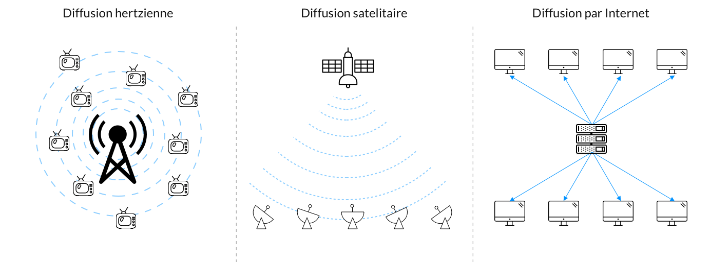
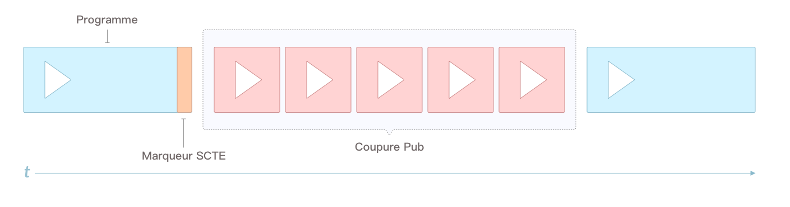
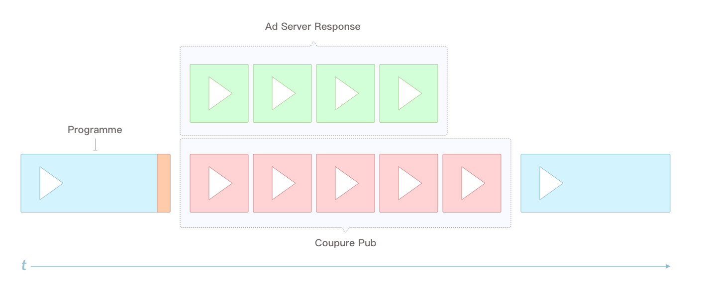
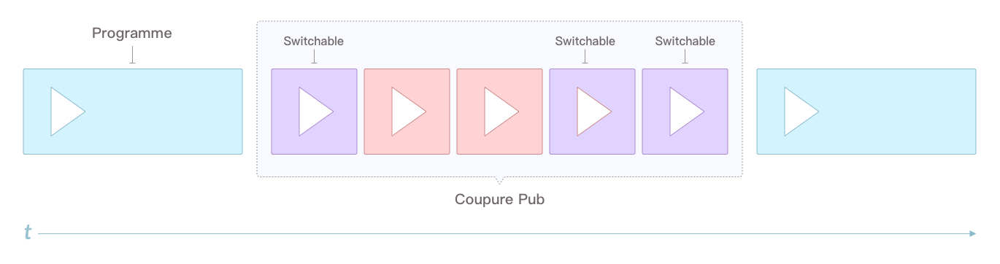
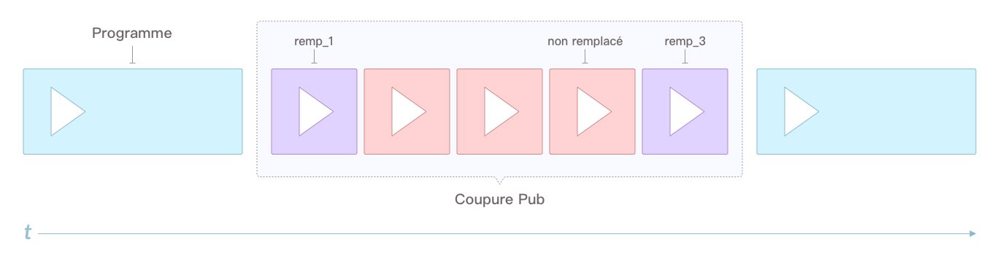

# TV Segmentée 

Saviez-vous qu'une loi contraignant les chaines de télévision à diffuser très exactement les mêmes publicités sur tout le territoire avait été récemment modifiée pour rendre possible ce que l’on appelle la Télévision Adressée, ou Segmentée ?

Le terme TV Adressable est probablement le plus explicite pour décrire le concept : il est maintenant possible d'adresser une publicité donnée à un public en particulier.

Dans cet article nous allons faire le tour de ce qu'est le flux linéaire, le broadcast, l'Ad Switching et surtout, comment nous pouvons faire de la télévision segmentée.


## La diffusion linéaire et broadcast

Dans le jargon de la télévision, nous parlons de flux linéaire pour le live (ou direct), c'est à dire le contenu diffusé par la chaine en live. Le contenu linéaire, ou live, a une particularité bien marquée : c'est très exactement le même contenu qui est diffusé aux téléspectateurs, programmes comme coupures publicitaires.

A contrario, les contenus à la demande comme le replay sont du contenu délinéarisé qui peut être relinéarisé, mais c'est [une autre histoire](https://www.tf1.fr/stream).

Concernant la diffusion du linéaire, à l’instar de la radio, la télévision fonctionne historiquement sur le principe du broadcast. Dans notre cas, nous parlons même de télédiffusion.

Le broadcast fonctionne de la manière suivante :

1. Un *émetteur* (antenne, serveur, …) partage un signal 
2. Des *récepteurs* (télévision, ordinateur, téléphone, …) captent le signal de l’émetteur

Pour qu’un émetteur partage un signal, il existe différents vecteurs. Les plus courants sont les suivants :

* Transmission par voie hertzienne : une antenne transmet un signal sous la forme d’ondes électromagnétiques (typiquement la TNT)
* Transmission satellite : une onde est également transmise, les paraboles captent alors le signal
* Transmission via IP : c’est à travers internet qu’un ordinateur, une box, une application mobile … se connecte à un serveur pour accéder au signal




Une des particularités du broadcast est le caractère unidirectionnel. Le signal ne va que dans un sens, il n'y a donc pas de voie de retour permettant de communiquer avec l'émetteur. Dans les faits, il existe dans certains cas des voies de retours mais par soucis de simplicité nous allons partir du postulat qu'il n'y en a pas.
Cette particularité, nous le verrons plus en détail plus tard, entraine une contrainte forte : les récepteurs peuvent lire le signal de l'émetteur mais ne peuvent pas envoyer d'informations à l’émetteur.
Par voie hertzienne cette contrainte est la plus évidente sachant que les émetteurs n'ont pas connaissance des récepteurs en train de consommer le signal.
Concernant le réseau IPTV, sur les box, le signal est fourni aux FAI qui prennent en charge la diffusion chez leurs abonnés, ce qui ne permet pas de savoir qui consomme le flux.

## L'insertion publicitaire 
Sur une vidéo en replay il est assez simple de placer des coupures publicitaire :  

* Celle du début (la pre-roll) prend sa place d'elle même. 
* Pour les autres (mid-roll et post-roll), elles sont définies à l'avance en sortie de studio et renseignées au serveur publicitaire qui se charge de les remplir en respectant les règles de pression publicitaire.

Au lancement d'un contenu en replay, une requête vers le serveur publicitaire est effectuée. Le serveur retourne alors une playlist de coupures publicitaires, chaque entrée dans la playlist étant référencée par sa position temporelle :

```xml
<?xml version="1.0" encoding="UTF-8"?>
<vmap:VMAP
    xmlns:vmap="http://www.iab.net/vmap-1.0x" version="1.0">
    <vmap:AdBreak breakId="0.0.0.626383864" breakType="linear" timeOffset="start">
        <vmap:AdSource allowMultipleAds="true" followRedirects="true" id="1">
            <vmap:VASTAdData>
                <VAST version="3.0">
                    <Ad id="876876575" sequence="1"></Ad>
                    <Ad id="876547563" sequence="2"></Ad>
                    <Ad id="397868790" sequence="3"></Ad>
                </VAST>
            </vmap:VASTAdData>
        </vmap:AdSource>
    </vmap:AdBreak>
    <vmap:AdBreak breakId="0.0.0.87657865" breakType="linear" timeOffset="00:23:12">
        <vmap:AdSource allowMultipleAds="true" followRedirects="true" id="1">
            <vmap:VASTAdData>
                <VAST version="3.0">
                    <Ad id="46754654" sequence="1"></Ad>
                    <Ad id="1987T378" sequence="2"></Ad>
                </VAST>
            </vmap:VASTAdData>
        </vmap:AdSource>
    </vmap:AdBreak>
</vmap:VMAP>
 
```

Le player, pour jouer les publicités réalise les opérations suivantes :
* Mise en pause de la vidéo
* Lecture des publicités
* Exécution de pixels de tracking
* Reprise du programme

Mais pour le linéaire, comment pouvons-nous gérer le placement des coupures publicitaires ?

## Le marquage de flux 
Quel que soit le format de transmission (satellite, antenne ou IP), le signal contient différentes informations telles que le contenu vidéo et audio, potentiellement des sous-titres voire même des marqueurs.
Tout comme le replay, des placements publicitaires sont renseignés en sortie non pas studio, mais en régie. Les marqueurs sont insérés par des automates qui indiquent les coupures publicitaires directement dans le flux temps réel du live.

Les marqueurs sont l'élément qui nous intéresse le plus ici. Ils permettent de faire deux choses capitales pour nous :
* Indiquer exactement une coupure publicitaire voire même un spot unitaire
* Indiquer le code écran de la coupure publicitaire

Comme nous le verrons plus tard, le positionnement exact nous permettra de savoir quand appeler le serveur publicitaire. Quant au code écran, il nous permettra de connaitre la durée de la coupure publicitaire.

## l'Ad Switching
Avant de voir comment le remplacement publicitaire, ou Ad Switching, fonctionne sur la TV Ségmentée, regardons un instant il fonctionne de manière traditionnelle, c'est à dire sur les environnements OTT (Web, applications mobiles).

Qu'il soit question de la lecture du live TF1 sur navigateur ou sur application mobile, le signal est consommé dans un environnement applicatif. Cet environnement permet de detecter la présence de marqueurs et d'exécuter des actions spécifiques à leur rencontre.

Par action spécifique il est bien question refaire de la pub, plus exactement du remplacement publicitaire afin de diffuser des publicités plus pertinentes pour l'utilisateur.

Concrètement, l’idée est la suivante :

1. Le client (navigateur, application mobile, ...) détecte un marqueur indiquant une coupure publicitaire



2. Le client effectue une requête vers le serveur publicitaire




3. Le client remplace la coupure pub du broadcast en superposant les publicités proposées par l’Ad Server


Nous avons de cette manière un tunnel publicitaire qui correspond à l'utilisateur et non plus les publicités de broadcast qui sont les mêmes pour tous.

Outre un ciblage publicitaire plus performant, c'est également l'opportunité de diffuser des publicités interactives qui s'ouvre. Si les publicités provenants du linéaire ne sont pas intéractives (non cliquable entre autres), les publicités provenants du remplacement peuvent être pleinement intéractives.

Cette technologie a d'ailleurs été [inauguré en France par TF1](https://www.lemediaplus.com/lad-switching-une-des-tendances-2016/) lors de la coupe du monde de rugby en 2015
Si vous n'êtres pas trop habitués à la publicité vous devez vous demander pourquoi remplacer une coupure publicitaire par .... Une coupure publicitaire ?

### Le ciblage publicitaire 

Nous avons parlé d'un ciblage plus performant, mais en quoi ça consiste ? Concrètement, le ciblage publicitaire a pour vocation de délivrer le bon message à la bonne personne afin de maximiser son potentiel et ainsi obtenir un meilleur retour sur investissement de la part des annonceurs.
La bonne publicité à la bonne cible, c'est, entre autres, ne pas diffuser une publicité pour les escaliers mécaniques à une cible 18/25 ans. C'est également faire des placements publicitaires adaptés à la localisation géographique de l'utilisateur.

Pour ce faire, [il existe différents paramètres](https://tf1pub.fr/landing/ciblez-vos-publicites-en-tv-et-digital) allant de la localisation géographique, l'utilisation de segments socio-démographiques (age, sexe, catégorie socio-professionnelle, ...) ou encore du ciblage comportemental (habitude de visionnage).
Parce que l'impact des publicités est plus important lorsqu'elles sont diffusées à la bonne cible, le remplacement publicitaire est un levier incroyable pour les annonceurs et justifier alors le remplacement de tunnels provenant du broadcast.


## Et l'Ad Switching, ça fonctionne sur la télévision ?
Nous avons parlé du fonctionnement du remplacement publicitaire (Ad Switching) sur les terminaux OTT (navigateur web, applications mobiles), mais qu'en est-il des télévisions ?
Comme nous l'avons vu en préambule de cet article, le broadcast ne permet pas d'avoir plusieurs signaux différents, c'est le même contenu vidéo linéaire pour tout le monde, mais ne pourrions-nous pas faire comme sur internet ? Après tout, aujourd'hui les télévisons sont connectées !
Bien qu'il soit techniquement faisable de faire de l'Ad Switching coté opérateur (FAI) ou directement sur une TV connectée consommant un flux TNT (HbbTV, ou Hybrid Broadcast Broadband TV), c'est le législateur qui a rendu possible la mise en place du remplacement publicitaire sur le broadcast hors OTT.


En effet, [l'article 13 du décret du 27 mars 1992](https://www.legifrance.gouv.fr/loda/article_lc/LEGIARTI000042213844) interdisait le décrochage publicitaire pour les chaines nationales. Autrement dit, les chaines nationales étaient astreintes à l'obligation de diffuser très exactement le même contenu publicitaire sur tout le territoire.
Depuis un allègement de la réglementation en 2020, le décrochage est devenu un enjeux majeur de la publicité pour les acteurs de la télévision tout comme il l'est sur OTT.
Le décrochage, ou la "segmentation", est possible suivant trois possibilités :
1. Décrochage local opéré par TDF sur le réseau TNT sur la base de la localisation géographique
2. Décrochage opéré par les téléviseurs compatibles HbbTV sur le réseau TNT
3. Décrochage opéré par l'opérateur (FAI)

Ce sont les deux dernières méthodes qui vont le plus nous intéresser.

### HbbTV et TNT

La norme HbbTV, qui équipe de plus en plus de téléviseurs, offre la possibilité d'enrichir le contenu audiovisuel d'éléments interactifs comme le start-over, le casting, des quiz ou encore des alertes. Le mode de fonctionnement de HbbTV repose sur le téléchargement d'une application HTML / Javascript qui s'exécute lors du visionnage de la chaine.

HbbTV fonctionne suivant deux modes :

* *Brodcast:* ne nécessite pas de connexion à internet, ne permet que d'utiliser des données contenues dans le flux live (casting, fiches annexes, ...)
* *Broadband:*  permet de profiter des options nécessitant une connexion à internet (start over, quizz, ...)

Étant donné qu'internet est fondamental pour pouvoir exécuter des requêtes publicitaires, le mode Broadband nous intéresse ici.
Concrètement, lorsque nous lançons le live TF1 sur un téléviseur compatible HbbTV, et après consentement, l'application se lance en tâche de fond et écoute la présence de marqueurs. Lorsqu'un marqueur est détecté, la télévision effectue une requête vers nos services afin d'obtenir potentiellement un spot ou des spots de remplacement.

À TF1, nous utilisons différentes briques pour faire de la TV Ségmentée : 

* **Wizads:** notre Ad Proxy faisant le lien entre les clients (box, tv, applications, ...) et les Ad Server ou, dans le cadre de la TV Adressable, PAULA. Il a pour but la construction des Ad Request, l'enrichissement des contenus et le formatage des réponses
* **PAULA:** constitue la brique située entre WizAds et l'Ad Server pour toutes des requêtes de TV Ségmentée. Son rôle est de determiner quels sont les spot remplaçables, les remplacer et appliquer les différentes règles métier liées à cette technologie

Lorsque nous recevons la requête, nous vérifions le contenu de la coupure publicitaire dans PAULA en nous référant au code écran contenu dans le marqueur. Si la coupure publicitaire du linéaire contient des spots marqués comme remplaçables, nous appelons le serveur publicitaire pour obtenir des spots de remplacement correspondant aux durées des spots remplaçables.



Nous construisons une playlist publicitaire (VAST, Video Ad Serving Template), correspondant au contenu de la coupure publicitaire.
Dans cette playlist nous intégrons les spots compatibles avec les différentes règles métier.




La playlist repasse par notre proxy pub (WizAds) qui se charge d'enrichir la playlist avec, entre autres, des jeux de tracking permettant, aussi bien pour les spots de remplacement que pour les placements publicitaires non remplacés, ce qui sera bien utile pour la mesure d'audience.
À ce moment là, le téléviseur récupère la playlist publicitaire et opère le remplacement des publicités ayant un spot de remplacement et exécute les trackings pour tous les emplacements publicitaires, qu'ils soient remplacés ou non.
Le remplacement, quant à lui, est effectué en superposant un player au flux linéaire le temps du remplacement. Une fois le remplacement terminé, le player jouant le spot de remplacement laisse la main au player jouant le contenu live.

### Remplacement coté opérateur 

Le remplacement, coté opérateur, c'est à dire les FAIs, fonctionne très exactement de la même manière de notre coté. Par contre au lieu que ça soit une application HbbTV gérée par nos soins qui effectue les appels au serveur pub et les remplacements, ceux-ci sont réalisés par les opérateurs.

Le schema est donc très similaire à ce que nous avons pu voir plus haut.

### La mesure d'audience

Peut-être que vous vous êtes posé la question de pourquoi nous ajoutons aussi des éléments de tracking lorsqu'il n'y a pas de spot de remplacement ?
Cet ajout n'est pas sans raison. Le tracking pour les spots remplacés est obligatoire. Sans eux nous ne serions pas à même de savoir si la publicité a été jouée ni même à quel niveau de complétion.
Dans les faits, les jeux de tracking standards pour une publicité vidéos sont les suivants :
* Un ou plusieurs pixel(s) à l'impression, c'est à dire à l'affichage de la publicité
* Un ou plusieurs pixel(s) à la lecture des premiers 25% de la publicité (autrement appelé First Quartile)
* Un ou plusieurs pixel(s) à la lecture de 50% de la publicité (autrement appelé Midpoint)
* Un ou plusieurs pixel(s) à la lecture de 75% de la publicité (autrement appelé Third Quartile)
* Un ou plusieurs pixel(s) à la lecture 100% de la publicité (autrement appelé Complete)

Le "Un ou plusieurs pixel(s)" est assez répétitif pour appuyer sur un principe important : un évènement (Impression, FirstQuartile, ...) peut parfaitement déclencher toute une série de pixels de tracking. Il y a les pixels insérés par le serveur publicitaire, ceux insérés par l'annonceur, ceux par le proxy (WizAds) à des fins de supervision, ... Entre l'annonceur et la diffusion il peut parfaitement y avoir toute une série d'intermédiaire qui, pour se rémunérer, ajoute ses pixels.

En dehors du tracking pour déterminer si une publicité a été vue et donc si elle est facturable, les trackings permettent également de mesurer l'audience.
Le mode de mesure d'audience sur la télévision fonctionne de la manière suivante :
1. Évaluation du nombre de téléspectateurs
2. Répartition des parts d'audience via des panels ([Médiamétrie](https://www.mediametrie.fr/fr/les-panels-indispensables-la-mesure-daudience)) 

Différentes méthodologies et technologies sont proposées pour faire de la mesure d'audience, mais l'exécution de tracking directement lorsqu'un spot est lu offre un niveau de détails maximal.
La TV Ségmentée n'est donc pas qu'une solution permettant de faire du remplacement de spots publicitaire, mais également une solution puissante de mesure d'audience.


