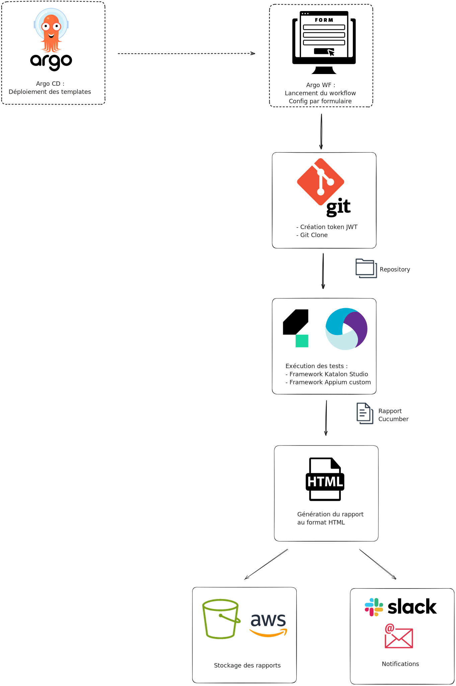

La migration de Jenkins vers une solution basée sur Docker avec Argo Workflows et Argo CD est une démarche stratégique visant à moderniser et optimiser les processus de test automatisés avec une possibilité d'intégration continue (CI) et de déploiement continu (CD).


## Contexte de la migration

Historiquement, l'équipe QA de la DT eTF1 utilisait Jenkins comme orchestrateur de lancement pour ses tests automatisés, via des pipelines d’exécution lancés manuellement ou de manière automatique. Les équipes de dev ayant peu à peu cessé de l'utiliser, la connaissance de l'administration de Jenkins s'est peu à peu perdu côté OPS, jusqu'au moment où ces derniers ont exprimé le souhait de le décomissionner. 

Deux choix s'offraient alors à nous :
* Rester sur Jenkins, et reprendre à notre charge l'administation et la maintenance de l'outil
* Miger au profit d'un autre outil 

Jenkins, bien que puissant et largement adopté, peut parfois présenter des défis en termes de gestion de pipelines complexes, d'orchestration de conteneurs et de maintenance. De plus, nous n'avions pas à l'époque les compétences en interne pour reprendre l'administation d'un tel outil. Notre choix s'est donc porté sur une migration vers une stack Argo Workflow / Argo CD dans des environnements Kubernetes.

### Pourquoi choisir Argo ?
1. **Scalabilité et flexibilité** : Les solutions basées sur Kubernetes, comme Argo, offrent une meilleure scalabilité et flexibilité comparée aux solutions traditionnelles. Argo Workflow permet d'orchestrer des workflows de manière native sur Kubernetes, tandis qu'Argo CD facilite le déploiement
2. **Gestion des dépendances et sécurité** : L'utilisation de conteneurs Docker améliore la gestion des dépendances et renforce la sécurité grâce à l'isolation des environnements.
3. **Simplification de la configuration et du déploiement** : Argo CD suit le principe GitOPS et utilise des définitions déclaratives des applications, rendant le processus de déploiement plus transparent et reproductible.
4. **Uniformisation** : la stack technique de la QA est la même (ou compatible) avec le reste des applications métier.


### Étapes de Migration

#### Analyse de l'environnement actuel :
* Évaluer les pipelines existants dans Jenkins
* Identifier les dépendances et les configurations spécifiques

#### Mise en place de Kubernetes :
* Installer et configurer le cluster Kubernetes 
* Déployer des outils nécessaires comme Helm pour la gestion des charts

#### Déploiement d'Argo Workflow :
* Installer Argo Workflow sur le cluster Kubernetes
* Créer des workflows

#### Configuration d'Argo CD :
* Installer Argo CD sur le cluster Kubernetes
* Configurer les repositories Git pour la synchronisation des applications
* Définir les applications et les environnements dans des manifestes Kubernetes

#### Migration des Pipelines Jenkins :
* Traduire les pipelines Jenkins en workflows Argo
* Tester et valider les workflows dans un environnement de staging
* Migrer progressivement les pipelines critiques pour minimiser les risques

#### Validation et Optimisation :
* Superviser les performances et ajuster les ressources Kubernetes
* Mettre en place des métriques et des alertes pour surveiller l'état des workflows et des déploiements


## Intégration dans notre contexte

Les workflows dans Argo sont décomposés en plusieurs images ayant chacun une tache définie :
* Clone du repository Git
* Exécution du framework de test
* Génération du rapport de test
* Envoi des notifications (Slack et/ou mail)
* Stockage des artefacts dans AWS



La déclaration de chacune de ses images et des ressources se fait de manière simple dans un fichier YAML
```yaml
apiVersion: kustomize.config.k8s.io/v1beta1
kind: Kustomization
namespace: qa
resources:
- resources/config-map.yaml
- resources/role-binding.yaml
- resources/service-account.yaml
- templates/git-clone
- templates/runner-katalon
- templates/reporting-cucumber
- templates/email-sending
```

Et on peut ensuite facilement déclarer un workflow complet, avec ces paramètres de lancement custom, toujours grâce à des fichiers YAML, comme par exemple :
```yaml
apiVersion: argoproj.io/v1alpha1
kind: WorkflowTemplate
metadata:
  name: qa-tf1plus-web
spec:
  entrypoint: main
  onExit: on-exit

  arguments:
    parameters:
    - name: branch
      value: main
    - name: profile
      value: VAL
      enum:
      - INT
      - VAL
      - PROD
    - name: browser
      value: chrome
      enum:
      - chrome
      - edge
      - ff
      - safari
    - name: os
      value: mac
      enum:
      - mac
      - windows
    - name: tags
      value: |-
        @Account
        @HomePage
        @LivePage
        @Login
        @ProgramPage
        @SearchPage
        @ShowPage
        @VideoPage

  templates:

  - name: main
    steps:
    - - name: git-clone
        templateRef:
          name: qa-templates-git-clone
          template: git-clone
        arguments:
          parameters:
          - name: repository
            value: path-to-repository
          - name: branch
            value: "{{workflow.parameters.branch}}"
    - - name: run-katalon
        templateRef:
          name: qa-templates-runner-katalon
          template: run
        arguments:
          parameters:
          - name: browserstack-licence
            value: tf1plus-web
          - name: browser
            value: "{{workflow.parameters.os}}_{{workflow.parameters.browser}}"
          - name: profile
            value: "{{workflow.parameters.profile}}"
          - name: suite
            value: TSC_TF1PLUS_WEB_FRONT
          - name: tag
            value: "{{item}}"
        withParam: "{{=toJson(sprig.uniq(sprig.compact(sprig.regexSplit('(\\n|,)', workflow.parameters.tags, -1))))}}"

  - name: on-exit
    steps:
    - - name: reporting
        templateRef:
          name: qa-templates-reporting-cucumber
          template: report
        arguments:
          parameters:
          - name: project
            value: "TF1+ WEB"
          - name: environment
            value: "{{workflow.parameters.profile}}"
          - name: branch
            value: "{{workflow.parameters.branch}}"
          - name: platform
            value: "{{workflow.parameters.os}}"
          - name: browser
            value: "{{workflow.parameters.browser}}" 
```


### Avantages Post-Migration

* **Orchestration native Kubernetes** : Argo Workflow s'intègre nativement à Kubernetes, offrant des fonctionnalités avancées d'orchestration et de gestion des tâches.
* **Déploiement déclaratif** : Argo CD utilise Git comme source de vérité, assurant que l'état des applications en production correspond toujours aux configurations définies.
* **Automatisation et réduction des erreurs** : Les workflows et déploiements sont automatisés et déclaratifs, réduisant ainsi les erreurs humaines.
* **Visibilité et traçabilité** : Les interfaces Argo fournissent une vue détaillée des workflows et des déploiements, facilitant le suivi et la résolution des problèmes.
* **Facilité de création et maintenance des workflows** : Mise à jour rapide des images. Intégration de nouvelles étapes dans les workflows. Création de briques réutilisables (images Docker et templates).
* **Rapport de test** : Les rapports d’exécution sont téléchargeables directement sur l’interface.
* **Interfaçage avec d’autres outils** : Possibilité de trigger Github Action pour l’intégration et déploiement continu ou d'utiliser Argo Events pour s'interfacer avec des outils tiers.


## Conclusion

La migration de Jenkins vers une solution Docker avec Argo Workflow et Argo CD représente une avancée significative pour notre équipe. D'un outil certes fonctionnel, mais peu maintenu et donc sans perspective d'évolution, nous sommes passés à une solution aux nombreux bénéfices en termes de scalabilité, flexibilité, et sécurité.
