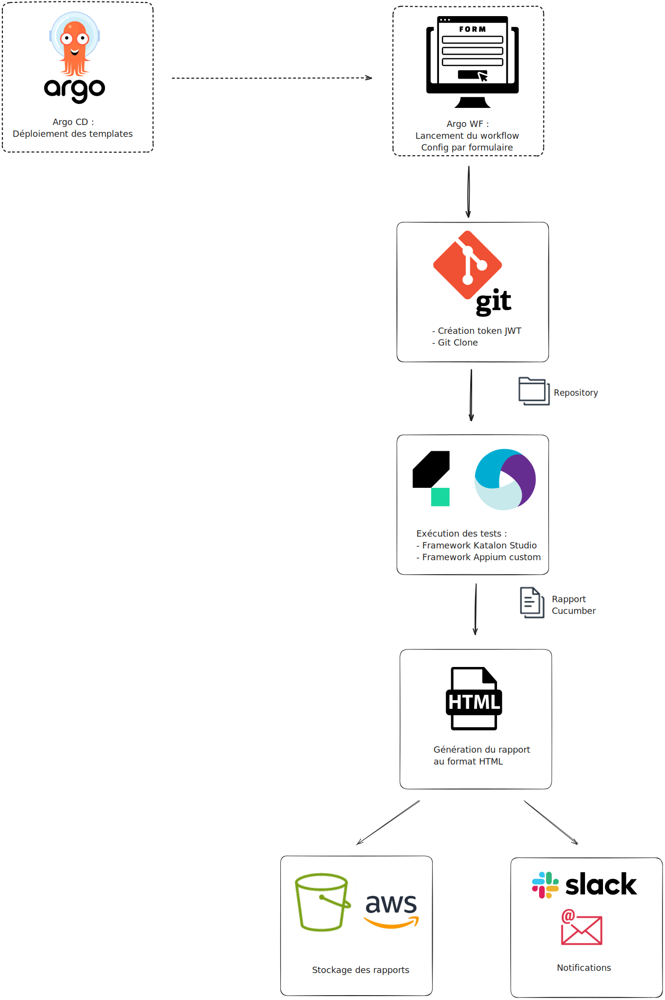

La migration de Jenkins vers une solution basée sur Docker avec Argo Workflows et Argo CD est une démarche stratégique pour l'équipe QA visant à moderniser et optimiser les processus de test automatisés avec une possibilité d'intégration continue (CI) et de déploiement continu (CD).


## Contexte de la migration

Historiquement, l'équipe QA de la DT eTF1 utilisait Jenkins comme orchestrateur de lancement pour ses tests automatisés, via des pipelines d’exécution lancés manuellement ou de manière automatique. Les équipes de dev ont peu à peu cessé de l'utiliser au profit d'autres outils de CI, au point où la QA était le dernier utilisateur et où les équipes OPS ont commencé à évoquer la question d'un décomissionnement.

Deux choix s'offraient alors à nous :
* Rester sur Jenkins, et reprendre à notre charge l'administation et la maintenance de l'outil
* Migrer au profit d'un autre outil 

Jenkins, bien que puissant et largement adopté, peut parfois présenter des défis en termes de gestion de pipelines complexes, d'orchestration de conteneurs et de maintenance. De plus, cette situation fut une bonne opportunité pour challenger nos besoins pour l'avenir. Notre choix s'est donc porté sur une migration vers une stack Argo Workflow / Argo CD dans des environnements Kubernetes.

### Pourquoi choisir Argo ?
Après une phase d'étude suivie d'un petit POC, notre choix s'est porté sur les solutions Argo pour les raisons suivantes : 
1. **Scalabilité et flexibilité** : Les solutions basées sur Kubernetes, comme Argo, offrent une meilleure scalabilité et flexibilité comparée aux solutions traditionnelles. Argo Workflow permet d'orchestrer des workflows de manière native sur Kubernetes, tandis qu'Argo CD facilite le déploiement
2. **Gestion des dépendances et sécurité** : L'utilisation de conteneurs Docker améliore la gestion des dépendances et renforce la sécurité grâce à l'isolation des environnements.
3. **Simplification de la configuration et du déploiement** : Argo CD suit le principe GitOPS et utilise des définitions déclaratives des applications, rendant le processus de déploiement plus transparent et reproductible.
4. **Uniformisation** : la stack technique de la QA est la même (ou compatible) avec le reste des applications métier.


### Étapes de Migration

#### Analyse de l'environnement actuel :
La première étape consiste d'abord à cartographier notre existant et s'assurer d'avoir tous les pré-requis nécessaire à la migration. Nous avons donc analyser les pipelines existants dans Jenkins et ainsi identifier les dépendances et les configurations spécifiques.

#### Mise en place de Kubernetes :
Une fois cette étude effectuée, nous pouvons passer à la migration en tant que telle, en installant et configurant le cluster Kubernetes, ce qui nous permettra de commencer à déployer des outils nécessaires.  

#### Déploiement d'Argo Workflow :
L'étape suivante consiste à [installer Argo Workflow sur le cluster Kubernetes](https://argo-workflows.readthedocs.io/en/latest/installation/), puis de commencer à créer en dur les workflows en utilisant un template par taches à accomplir (voir plus bas pour la description d'un workflow complet)

#### Configuration d'Argo CD :
Une fois nos workflows définis en dur, nous pouvons passer à ArgoCD pour péréniser la déclaration de ces workflows templates en nous donnant la possibilité de les redéployer en cas de besoin. Nous avons donc d'abord [installé Argo CD sur le cluster Kubernetes](https://argo-cd.readthedocs.io/en/stable/getting_started/) afin de pouvoir y définir les applications et les environnements dans des manifestes Kubernetes, que nous avons versionné dans nos repositories Git pour la synchronisation des applications.

#### Migration des Pipelines Jenkins :
Tous les pré-requis étaient alors réunis pour commencer effectivement la migration.\
Par sécurité, nous avons d'abord commencé par sélectionné un premier pipeline, celui de tests automatisés du site Web de TFOU MAX. Nous avons traduit le pipeline Jenkins en workflows Argo en utilisant les briques définies précédemment, et nous l'avons testé dans un environnement de staging. Une fois celui-ci validé, nous avons pu le déployer dans l'environnement de prod, et après 2 semaines de double run, nous avons comparé les résultats entre Jenkins et Argo avant de décider de stopper le pipeline dans Jenkins.\
Puis nous avons décliné cette procédure de migration pipeline par pipeline, avec un double run pour minimiser les risques

#### Validation et Optimisation :
Une fois tous les pipelines Jenkins migrés et transformés en workflow Argo, il ne restait plus que quelques affinages.\
Nous avons d'abord supervisé les performances pour ajuster les ressources Kubernetes en conséquence (augmentation ou diminution de la RAM et/ou du CPU des instances par exemple).\
Et enfin des métriques ont été mis en place, ainsi que des alertes pour surveiller l'état des workflows et des déploiements.


## Intégration dans notre contexte

Les workflows dans Argo sont décomposés en plusieurs images ayant chacun une tache définie :
* Clone du repository Git
* Exécution du framework de test
* Génération du rapport de test
* Envoi des notifications (Slack et/ou mail)
* Stockage des artefacts dans AWS



La déclaration de chacune de ses images et des ressources se fait de manière simple dans un fichier YAML grâce à [Kustomize](https://kustomize.io/) (inclus nativement dans Kubernetes)
```yaml
apiVersion: kustomize.config.k8s.io/v1beta1
kind: Kustomization
namespace: qa
resources:
- resources/config-map.yaml
- resources/role-binding.yaml
- resources/service-account.yaml
- templates/git-clone
- templates/runner-katalon
- templates/reporting-cucumber
- templates/email-sending
```

Et on peut ensuite facilement déclarer un workflow complet, avec ses paramètres de lancement custom, toujours grâce à des fichiers YAML, comme par exemple :
```yaml
apiVersion: argoproj.io/v1alpha1
kind: WorkflowTemplate
metadata:
  name: qa-tf1plus-web
spec:
  entrypoint: main
  onExit: on-exit

  arguments:
    parameters:
    - name: branch
      value: main
    - name: profile
      value: VAL
      enum:
      - INT
      - VAL
      - PROD
    - name: browser
      value: chrome
      enum:
      - chrome
      - edge
      - ff
      - safari
    - name: os
      value: mac
      enum:
      - mac
      - windows
    - name: tags
      value: |-
        @Account
        @HomePage
        @LivePage
        @Login
        @ProgramPage
        @SearchPage
        @ShowPage
        @VideoPage

  templates:
  - name: main
    steps:
    - - name: git-clone
        templateRef:
          name: qa-templates-git-clone
          template: git-clone
        arguments:
          parameters:
          - name: repository
            value: path-to-repository
          - name: branch
            value: "{{workflow.parameters.branch}}"
    - - name: run-katalon
        templateRef:
          name: qa-templates-runner-katalon
          template: run
        arguments:
          parameters:
          - name: browserstack-licence
            value: tf1plus-web
          - name: browser
            value: "{{workflow.parameters.os}}_{{workflow.parameters.browser}}"
          - name: profile
            value: "{{workflow.parameters.profile}}"
          - name: suite
            value: TSC_TF1PLUS_WEB_FRONT
          - name: tag
            value: "{{item}}"
        withParam: "{{=toJson(sprig.uniq(sprig.compact(sprig.regexSplit('(\\n|,)', workflow.parameters.tags, -1))))}}"

  - name: on-exit
    steps:
    - - name: reporting
        templateRef:
          name: qa-templates-reporting-cucumber
          template: report
        arguments:
          parameters:
          - name: project
            value: "TF1+ WEB"
          - name: environment
            value: "{{workflow.parameters.profile}}"
          - name: branch
            value: "{{workflow.parameters.branch}}"
          - name: platform
            value: "{{workflow.parameters.os}}"
          - name: browser
            value: "{{workflow.parameters.browser}}" 
```


### Avantages Post-Migration

* **Orchestration native Kubernetes** : Argo Workflow s'intègre nativement à Kubernetes, offrant des fonctionnalités avancées d'orchestration et de gestion des tâches.
* **Déploiement déclaratif** : Argo CD utilise Git comme source de vérité, assurant que l'état des applications en production correspond toujours aux configurations définies.
* **Automatisation et réduction des erreurs** : Les workflows et déploiements sont automatisés et déclaratifs, réduisant ainsi les erreurs humaines.
* **Visibilité et traçabilité** : Les interfaces Argo fournissent une vue détaillée des workflows et des déploiements, facilitant le suivi et la résolution des problèmes.
* **Facilité de création et maintenance des workflows** : Le fonctionnement sous forme de briques indépendantes et réutilisables (images Docker et templates) facilite grandement l'évolutivité (déclinaison basée sur des workflows existant, intégration de nouvelles étapes dans les workflows...) ainsi que la maintenance (mise à jour rapide des images par exemple)
* **Rapport de test** : Les rapports d’exécution sont téléchargeables directement sur l’interface.
* **Interfaçage avec d’autres outils** : La modularité d'Argo Workflow permet de facilement s'interfacer avec des outils et en particulier de permettre à ceux-ci de déclencher l'éxécution d'un workflow. On peut penser par exemple à Github Actions qui propose ce type d'interface dans sa marketplace ou d'utiliser le framework natif [Argo Events](https://argoproj.github.io/argo-events/sensors/triggers/argo-workflow/).


## Conclusion

La migration de Jenkins vers une solution Docker avec Argo Workflow et Argo CD représente une avancée significative pour notre équipe. D'un outil à l'avenir incertain, nous sommes passés à une solution aux nombreux bénéfices en termes de scalabilité, flexibilité, et sécurité.

En terme de perspectives d'avenir, cette migration nous ouvre un champ des possibles et nous avons déjà plein de projets dont certains sont déjà en cours de réalisation. On peut par exemple citer l'intégration des workflows de tests automatisés dans les différentes CI des équipes de développement. Nous avons aussi dans l'idée de mettre en place une interface entre Argo et Jira/Xray, qui nous permettrait par exemple de déclencher un workflow à la création d'une campagne de test dans Xray, puis d'y insérer les résultats des tests automatisés une fois ceci joués, afin de centraliser dans le même référentiel nos resultats de tests manuels et automatisés.