## Un choix d'équipe

Fin 2023, la refonte de l’application MyTF1 en TF1+ s’accompagne par un changement de design, avec au programme la création d’un design system.

Comme c’est un nouveau design system, c’est l’occasion de se repencher sur les choix techniques, afin qu’ils soient à la fois pragmatiques sur le court terme pour garder notre vélocité, et fiables sur le long terme. 

Dans cet article, nous allons expliquer ces choix techniques qui ont été faits sur iOS pour implémenter les nouvelles icônes.

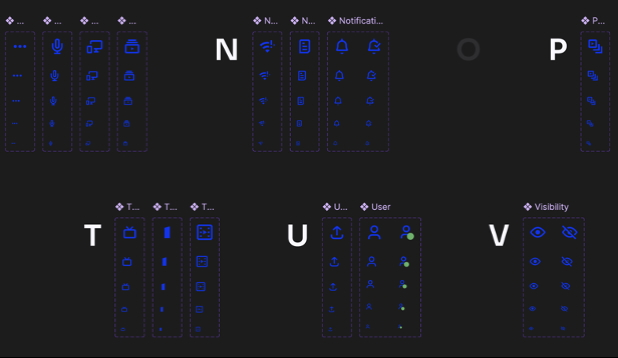
_Extrait des icônes TF1+ dans le Design System, notez l’icône bicolore pour l'icône User_

Jusqu’à présent, les icônes étaient implémentées en grande majorité dans l’application sous la forme de fichiers svg/pdf, et quelques images (png) pour gérer certains logos complexes.

De là, il y avait trois possibilités :
- revenir sur des bitmaps (images)
- continuer à utiliser des svg
- utiliser des symboles [SFSymbol](https://developer.apple.com/sf-symbols/)

Les bitmaps (images) et svg sont assez connus, nul besoin de les présenter à nouveau.

Les SFSymbols sont une nouvelle façon d’implémenter des icônes dans une application iOS. Introduits en 2019 ([WWDC](https://developer.apple.com/videos/play/wwdc2019/206/)) comme une série consistante d’icônes, dans la continuité d’iOS 13, ils ont évolué entre 2020 et 2022 et permettent maintenant de créer des symboles personnalisés, de gérer les symboles bicolores, à casse variable ou animés.

Nous nous sommes donc demandé en équipe quel serait le meilleur choix. Les critères étaient :
- Sur le court terme, quelle est la solution la plus performante
- Sur le court terme, quelle est la solution la moins coûteuse, la plus simple
- Sur le long terme, quelle est la solution la plus flexible
- Est-ce qu’il y’a de la traction, est-ce qu’on fait un choix standard
- Faut-il former les développeurs, les designers

Pour ce faire nous avons fait un [ADR](https://github.com/joelparkerhenderson/architecture-decision-record). Le but : décrire le choix architectural pris en équipe en évaluant les différentes solutions sur les critères que nous avons défini précédemment.

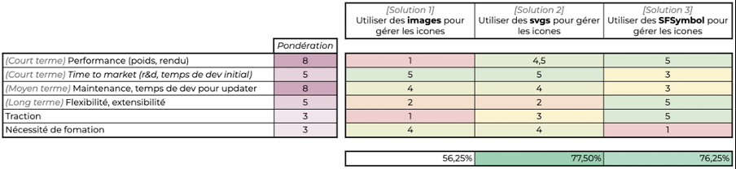

L’évaluation selon les critères nous a rapidement permis d’éliminer l’utilisation d’images, peu performantes.

Finalement, l’équipe avait à choisir entre :
- Utiliser des svg : comme actuellement mais moins extensible
- Tester SFSymbol : un peu d’inconnu, mais plus flexible

La présence dans le nouveau design system d’icônes bicolores nous fait pencher vers SFSymbol.

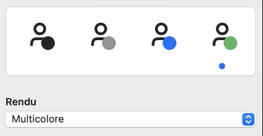

En équipe, nous choisirons l’option 3 : expérimenter SFSymbol.

## A la frontière de deux modèles de design

Les designers de la nouvelle expérience TF1+ ont utilisé le modèle de Material ([Google](https://m3.material.io/styles/icons/designing-icons)). Les icônes rentrent toutes dans une grille de 24x24 pixels, avec une guideline.

Exemple de guideline             |  
:-------------------------:|:-------------------------:
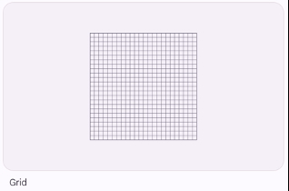  |  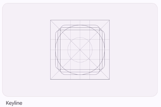

Cette guideline permet de gérer quatre types d’icônes :

- Carré

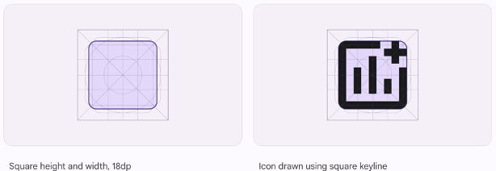

- Ronde

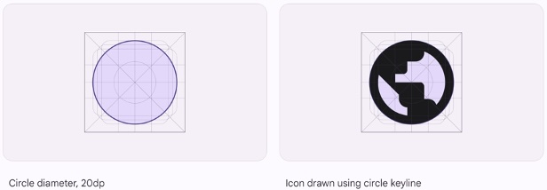

- Verticale

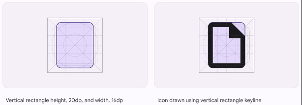

- Horizontale

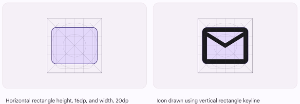

Le modèle SFSymbol de Apple fonctionne différemment.

Conceptuellement, SFSymbol passe par un rendu de police de caractère. Ceci permet d’ailleurs d’optimiser les performances, et de gérer le multi-casse (bold, thin, etc…)

Pour ce faire, il faut ajouter le path dans un template.

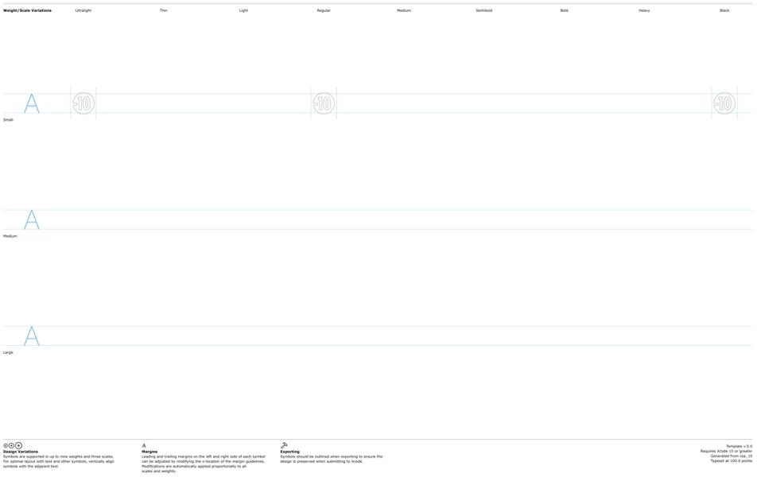

Et :

- Centrer et dimensionner le chemin par rapport aux lignes horizontales (caps lignes)
- Positionner les petites lignes verticales pour indiquer les marges

Nous avons donc essayé de comprendre les deux modèles et de savoir comment passer de l’un à l’autre.

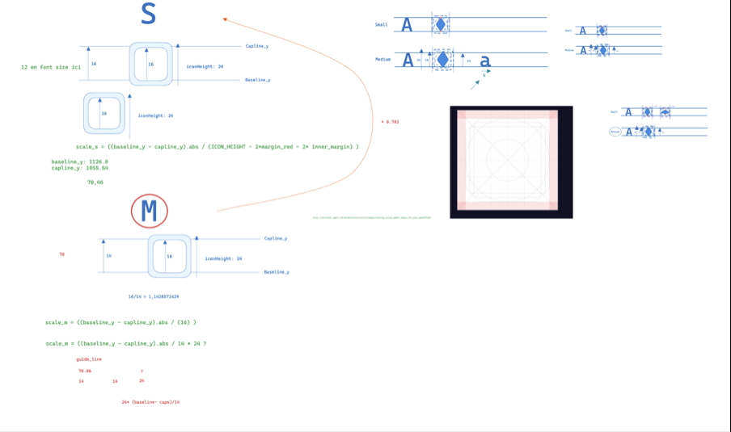

Le problème est le suivant : on veut que pour une police d'écriture de caps line 14px, une icône carrée fasse 16 pixels sans marge et 24 pixels avec marge.

Visuellement, les icônes TF1 sont de taille medium :

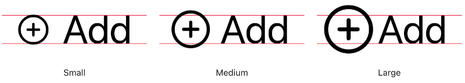

Il faut donc calculer, pour chaque symbole :

- Créer un template
- Remplacer les symboles dans la taille “small”, pour les casses “Ultralight”, “Regular” et “Black” par le symbole voulu, mis à l’échelle
- Gérer les marges sur les côtés de ces symboles

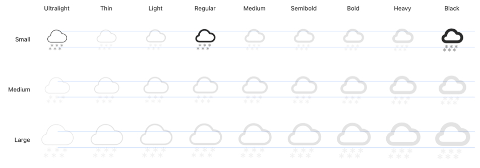

C’est une opération faisable à la main mais très peu maintenable. Nous avons donc créé un script pour ce faire.

## Automatisation

L’idée était d’écrire un script qui permette de convertir une icône ou un batch d’icônes.

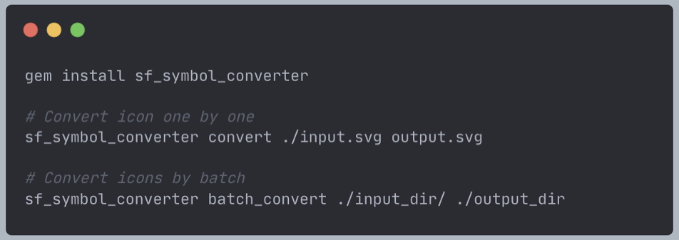

Nous avons choisi de faire ce script en Ruby : la plupart des développeurs iOS ont Ruby d’installé sur leur machine (pour la gestion des dépendances avec [Cocoapods](https://cocoapods.org/) par exemple).

Les détails du script sont disponibles sur [ce repository](https://github.com/tychota/SfSymbolConverter)

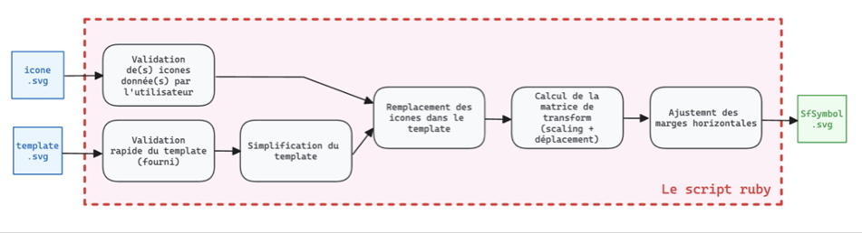

La première étape est de vérifier le contenu des fichiers svg qui seront envoyés en input du script :

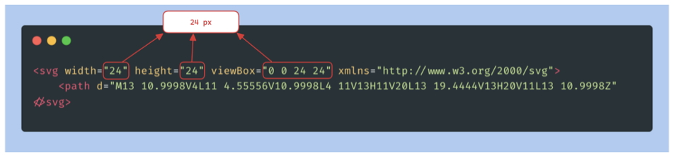

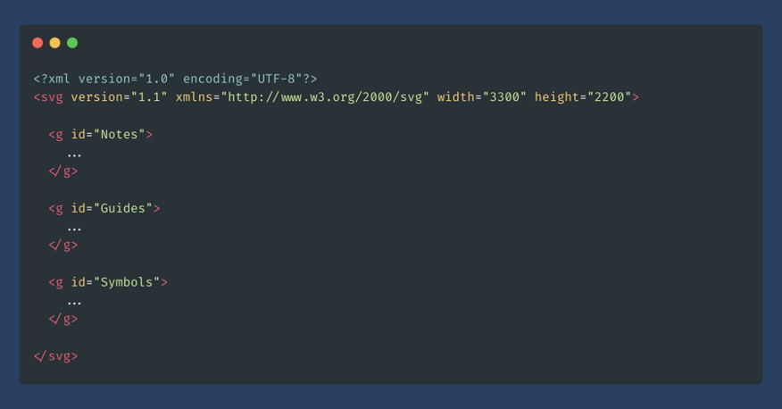

On cherche à vérifier que le svg fait la bonne taille (24x24px) et soit à la bonne viewbox. On peut se concentrer sur le format des SFSymbols, il s'agit d'un SVG avec 3 sections :
- "notes" : elle contient des indications visuelles comme les titres de lignes et de colonnes.
- "guides" : elle contient les repères verticaux et horizontaux.
- "symbols" : elle contient les symboles

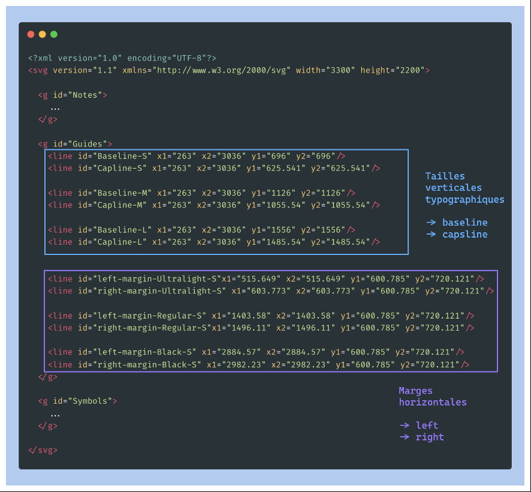

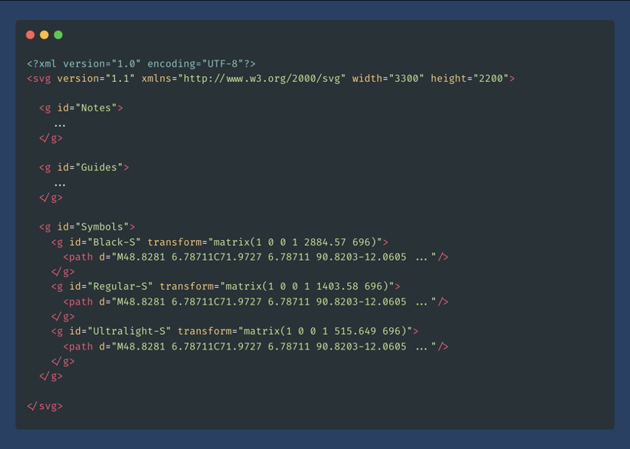

L’algorithme va tout d’abord générer la bonne matrice de transformation pour positionner et redimensionner les symboles correctement, et insérer le path de l’icône à la place du path des symboles.

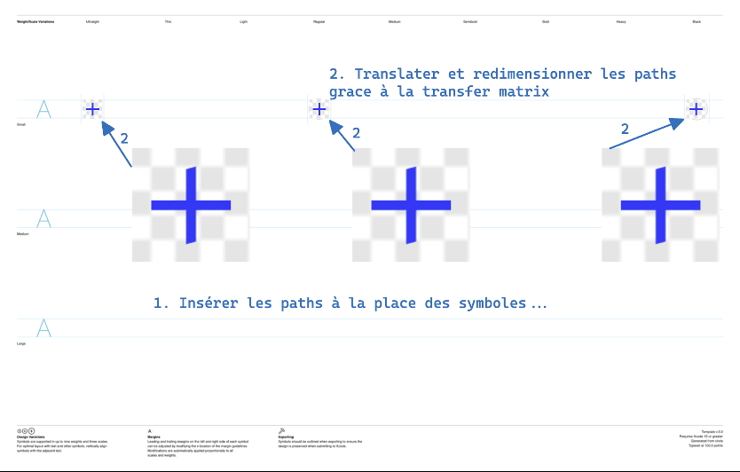

```ruby
require "nokogiri"

def get_guide_value(template_svg, axis, xml_id)
  guide_node = template_svg.at_css("##{xml_id}")
  raise 'invalid axis' unless %i[x y].include?(axis)

  val1 = guide_node["#{axis}1"]
  val2 = guide_node["#{axis}2"]
  raise "invalid #{xml_id} guide" if val1.nil? || val1 != val2

  val1.to_f # Convert the value from string to float.
end

def transform_matrix(symbol)
    translation_x = horizontal_center(symbol) - scaled_size_small / 2
    translation_y = vertical_center_small - scaled_size_small / 2

    matrix_text = "%<scale>.6f 0 0 %<scale>.6f %<trans_x>.6f %<trans_y>.6f"
    parameters = { scale: scale_factor_small, trans_x: translation_x, trans_y: translation_y }

    format(matrix_text, parameters)
end

def vertical_center_small
    baseline_y = get_guide_value(template_svg, :y, "Baseline-S")
    capline_y = get_guide_value(template_svg, :y, "Capline-S")

    (baseline_y + capline_y) / 2
end

def horizontal_center(symbol)
    left_margin = get_guide_value(template_svg, :x, "left-margin-#{symbol}")
    right_margin = get_guide_value(template_svg, :x, "right-margin-#{symbol}")

    (left_margin + right_margin) / 2
end

def cap_height_small
    baseline_y = get_guide_value(template_svg, :y, "Baseline-S")
    capline_y = get_guide_value(template_svg, :y, "Capline-S")

    (baseline_y - capline_y).abs
end

def scale_factor_small
    cap_height_small / REFERENCE_SFSYMBOL_FONT_CAPS_HEIGHT * SFSYMBOL_MEDIUM_TO_SMALL_SCALE
end

def scaled_size_small
    SOURCE_ICON_VIEWBOX_SIZE * scale_factor_small
end
```

Une fois cette matrice calculée, on peut remplacer le template par l’icône, à la bonne taille
```ruby
require "nokogiri"

class SFSymbolConverter
	IDS_TO_REPLACE = %w[Ultralight-S Regular-S Black-S].freeze

  def replace_template_symbols_with_source_icons
    IDS_TO_REPLACE.each do |symbol|
      template_symbol_node = template_svg.at_css("##{symbol}")

      template_symbol_node["transform"] = "matrix(#{transform_matrix(symbol)})"

      paths = icon_svg.dup.root.children
      paths.each do |node|
        node.delete("fill")
        node["class"] = "SFSymbolsPreviewWireframe"
      end

      template_symbol_node.children = paths
    end
  end
end
```

Il ne reste plus qu’à ajuster les marges horizontales
```ruby
MARGIN_LINE_WIDTH = 0.5

def adjusted_left_margin(symbol)
    # TODO: is it really (MARGIN_LINE_WIDTH / 2) or just MARGIN_LINE_WIDTH
    horizontal_center(symbol) - scaled_size_small / 2 - (MARGIN_LINE_WIDTH / 2)
end

def adjusted_right_margin(symbol)
    # TODO: is it really (MARGIN_LINE_WIDTH / 2) or just MARGIN_LINE_WIDTH
    horizontal_center(symbol) + scaled_size_small / 2 + (MARGIN_LINE_WIDTH / 2)
end
def adjust_guidelines
    IDS_TO_REPLACE.each do |symbol|
      left_margin_node = template_svg.at_css("#left-margin-#{symbol}")
      left_margin_node["x1"] = left_margin_node["x2"] = adjusted_left_margin(symbol).to_s

      right_margin_node = template_svg.at_css("#right-margin-#{symbol}")
      right_margin_node["x1"] = right_margin_node["x2"] = adjusted_right_margin(symbol).to_s
    end
end
```

## Bons assets, bonne application

Les SFSymbols utilisent un système de rendu différent des svg par rapport à ceux qui sont ajoutés directement dans Xcode. Ils sont plus performants, mais aussi moins flexibles, voici les caractéristiques importantes à prendre en compte :

### La fill-rule svg “even-odd” n’est pas supportée

SVG utilise un attribut “fill-rule” pour déterminer l’algorithme à utiliser pour déterminer les parties qui sont considérées à l'intérieur de la forme. Il y a deux algorithmes principaux :

- fill-rule
- even-odd

Pour comprendre la différence, voici un exemple :


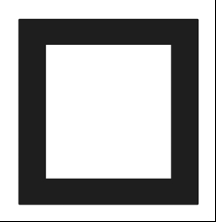

Il faut comprendre que ce “cadre” est composé de deux chemins. Chaque chemin a son orientation.

Par exemple :
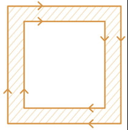

L’algorithme fill-rule va servir à déterminer quel chemin est rempli ou non.

Avec even-odd :
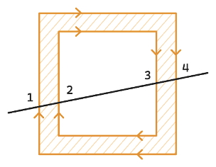

Avec non-zero :
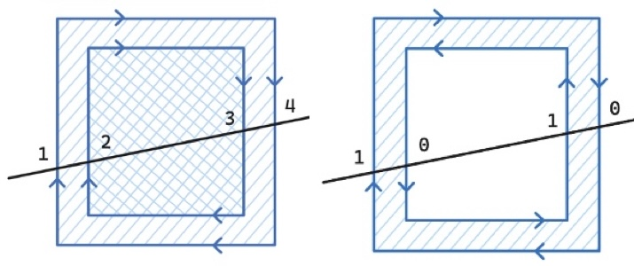

Figma génère des svg even-odd par défaut, mais SFSymbol a besoin de svg non-zero. On peut utiliser le plugin Figma [fill-rule editor](https://www.figma.com/community/plugin/771155994770327940/fill-rule-editor) pour inverser les paths.

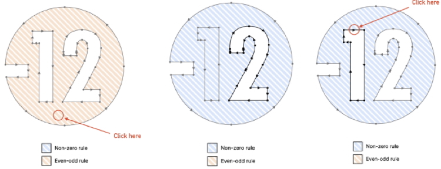

### La rotation doit être appliquée

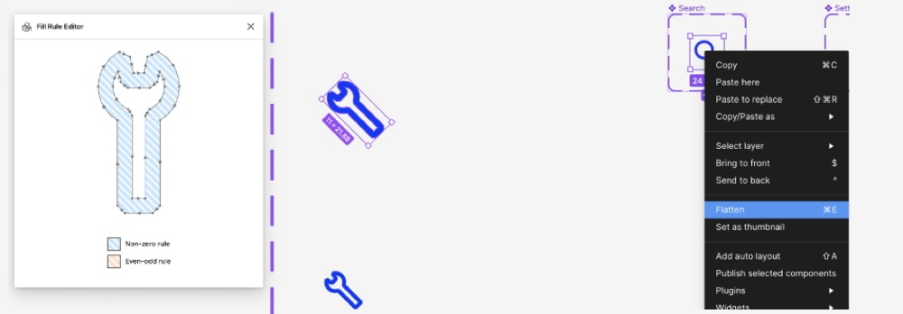

### Les paths doivent être fermés, sans superposition

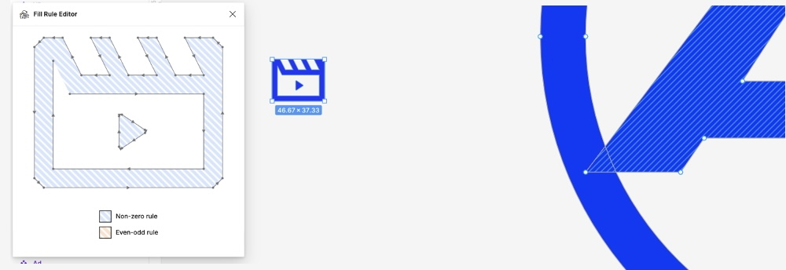

Nous avons fermé les paths dans Figma et utilisé le plugin [really-flatten-vectors](https://www.figma.com/community/plugin/1099596352042014853).

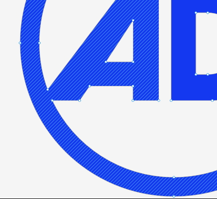

## Les résultats sont plus larges que prévus

Le fait d’améliorer les assets en accord avec les designers a aussi amélioré la performance d’autres équipes, Android et Web, qui avaient des problèmes similaires.

## Conclusion

La refonte de l’application MYTF1 en TF1+ aura été une vraie opportunité technique pour remettre en question le choix technique pour le format des icônes utilisées dans l’application. L’ADR qui a été fait a permis de guider l’équipe dans le choix final, et l’exploration des SFSymbol qui a abouti avec succès a conforté notre choix de continuer à les utiliser dans notre Design System à l’avenir.

