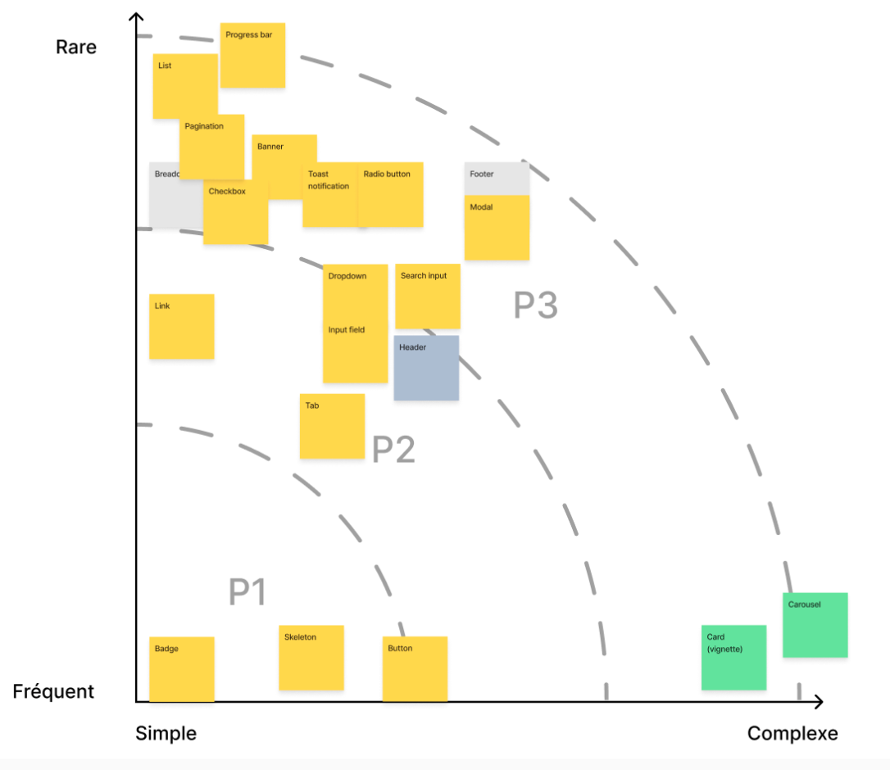

# Mise en place d'un Design System pour TF1+

## Contexte

### Un Design System, à quoi ça sert ?

Toute équipe ayant travaillé sur des projets importants connaît ces problèmes : les titres, les sous-titres, les boutons ou encore les espacements, diffèrent d'une page à l'autre.

Les développeurs, ne pouvant anticipé ou prévoir toutes les évolutions produits, vont commencer à tordre le composant, le rendant immaintenable, intestable et incompréhensible. Disposer d'un Design System permet de rendre les composants indépendants des spécificités des demandes produits.

Dans le cadre de notre projet TF1+, nous avons rapidement identifié le Design System comme une solution idéale pour uniformiser et structurer nos efforts. L’objectif principal du Design System était de :

- Garantir une cohérence visuelle et fonctionnelle au sein du produit.
- Assurer une évolutivité : toute modification apportée est automatiquement répercutée sur l'ensemble du projet.
- Améliorer la qualité et la cohérence du code.
- Renforcer l'accessibilité.
- Accélérer le processus de création pour les nouvelles pages.

### Comment initier le projet au sein d'eTF1 ?

eTF1 est composée de 7 équipes front avec un total de 70 développeurs. Pour initier ce projet, le choix a été fait d'attribuer cette tâche à une seule équipe, afin de déblayer le sujet avec ses avantages et ses inconvénients. Construire les bases du projet et ensuite engager les autres.

Plus exactement, il a été décidé d'assigner 2 développeurs web, un designer et un PO pour amener à bien ce projet.

Ci dessous, compte rendu de l'atelier de priorisation des composants:


## Contraintes Techniques

### Taille de la librairie

Pour que la librairie soit au standard des librairies disponibles en open source, tel que MUI ou Mantine, il faut que notre librairie permette de charger un composant ou une fonctionnalité sans embarquer la librairie en entier, plus connu comme "code splitting".

### Compatibilité avec le SSR

Ajoutons à cela une contrainte supplémentaire : nous avons besoin que tous nos composants puissent être rendus en SSR (server side rendering).

Nous devons donc prendre en compte les contraintes du "hydrate" de React. Par exemple, le DOM rendu par React doit être le même entre le serveur et le client, pour ensuite être modifié une fois que l'hydratation est terminée.

### SEO/a11y friendly & analytics/tracking ready

Notre implémentation du design system est conçue pour être utilisée, pour le moment, uniquement par le site de [TF1+](https://www.tf1.fr/), mais il doit tout de même prendre en compte des métiers non techniques/développeurs, tels que les besoins de l'équipe SEO, l'accessibilité (a11y) et les données d'analyse (analytics/tracking).

## Comment fonctionne la collaboration entre Designers et Developpeurs ?

Tout d'abord, il a fallu trouver des outils communs aux différents metiers.
Deux outils sont tres utilisés dans l’écosystème.

1. Figma

   Outil qui permet aux designers de fournir des maquettes precises qui vont pouvoir directement être utilisés par les développeurs

2. Storybook

   Outil qui va permettre aux designers de verifier unitairement et rapidement les composants développés.


Mais ces outils ne font pas tout, il faut aussi organiser les typographies, les palettes de couleurs, les niveaux de decoupages, les contraintes sur les composants dues au SSR.

Un sujet crucial est le nommage, que ce soit pour les couleurs, les tailles ou grasses de texte.
Les noms sont découpes en 2 categories.
Un nom "brut", par exemple "text-grey-500" ou "text-2xl".
et ensuite des noms de "role", "text-title", qui sera une combinaison 2 classes css précédentes

## Architecture Technique

### Choix des outils

Au-delà de Figma & Storybook, pour la partie technique, nous avons choisi le format "monorepo" pour gérer tous nos composants. Pour la gestion du monorepo, nous utilisons [pnpm](https://pnpm.io/), un package manager très rapide avec [Turborepo](https://turbo.build/repo/docs) qui permet de créer simplement et efficacement des pipelines pour automatiser les tâches afin qu'elles soient lancées dans tous les packages concernés.

Ensuite, pour la gestion des versions de nos composants, nous avons choisi d'utiliser [changesets](https://github.com/changesets/changesets). Cet outil est très important car nous avons un package publié par composant. On peut configurer changesets pour mettre à jour et republier tous les packages lorsqu'une de leurs dépendances est modifié.
Nous avons fait le choix de faire un package par composant, car le projet était en perpétuelle évolution, ainsi, le composant `Button` allait pouvoir être modifier entre sa publication initiale et son intégration dans le composant `Header`.
Il fallait donc pouvoir "verrouiller" la version du composant car si pour une raison ou une autre l'API de `Button` changeait, il ne fallait pas casser le header, ou forcer à mettre à jour tous les composants intégrant `Button`

Pour l'architecture de nos composants, nous avions 2 options à départager:

- les slots
- les compound components

Les slots sont un système natif et bien connu dans Vue, permettant de définir des emplacements que les composants parents peuvent utiliser pour insérer du contenu à des endroits spécifiques.

Les "compound components" dans React sont des composants conçus pour travailler ensemble, partageant un état commun. Ils permettent une modularité accrue en évitant la propagation de props, comme avec un Select et ses sous-composants Option et Label.

Notre choix a été d'utiliser les "[Compound Components](https://www.patterns.dev/react/compound-pattern/)", car il nous semblait plus adapter à nos besoins (reorganisation ou reordonnement de certaines logique).

De plus, les slots ne sont pas une fonctionnalité native dans React, cela n'a pas joué à son avantage

## Voici un exemple de notre code pour notre `ProgramCard`

```tsx
export const ProgramCard: FC = () => {
  return (
    <>
      <div {...getToggleProps()}>
        <ProgramCard {...restProps}>
          <ProgramCard.Thumbnail />
          <ProgramCard.Title />
        </ProgramCard>
      </div>
      <AnimationCard
        animationDirection={animationDirection}
        animationDuration={animationDuration}
        animationScale={animationScale}
        isAlternativeAnimation
        isSmoothAnimation
        {...getAnimationCardProps()}
      >
        <ProgramCard {...restProps} isHovered>
          <ProgramCard.Media>
            <ProgramCard.Preview />
            <ProgramCard.Actions />
          </ProgramCard.Media>
          <ProgramCard.Details>
            <ProgramCard.Title />
            <ProgramCard.Metadata />
          </ProgramCard.Details>
        </ProgramCard>
      </AnimationCard>
    </>
  );
};
```

Il est important de noté aussi que notre librairie a été pensé pour être "library agnostic" hormis React.
Cela veut dire que l'integration de la librairie peut se faire dans n'importe quel projet React.
La librairie de routing pourrait être react-router ou tanstack router. Et ce fonctionnement est valide pour le tracking, le data fetching, etc...

### Bilan

Le bilan est extrêmement positif car les objectifs fixés ont été remplis.
A savoir, faire adopter le Design System par les autres équipes front.
Une simplification et standardisation des designs.
Relation "rapprochée" entre les développeurs et les designers qui a permis d'avancer de manière pérenne et avec vélocité.
