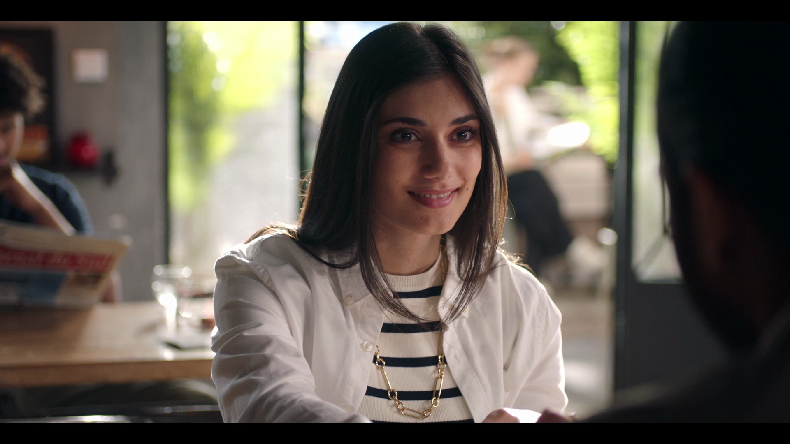
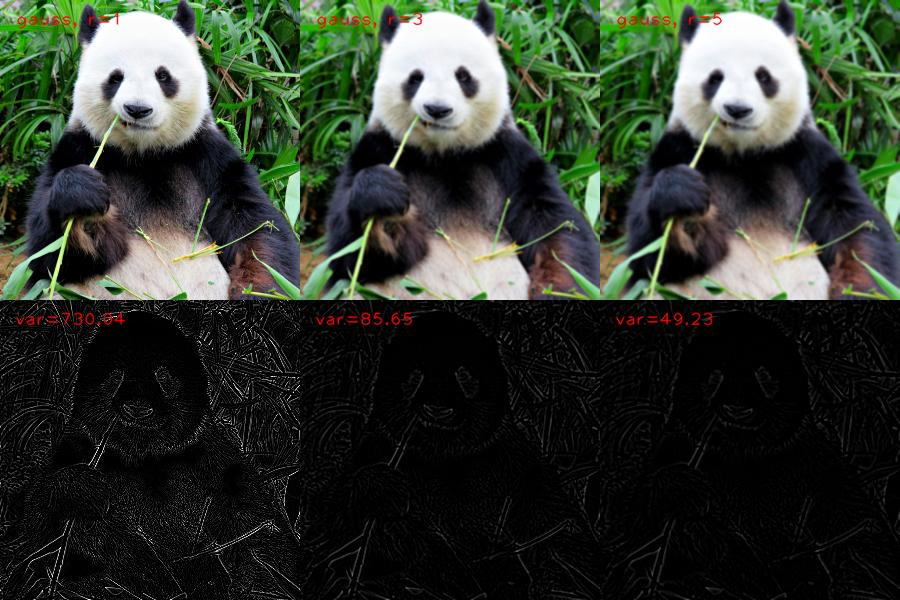
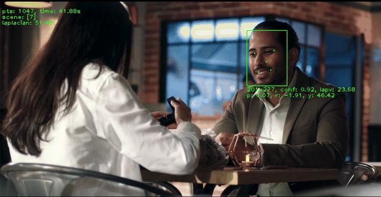
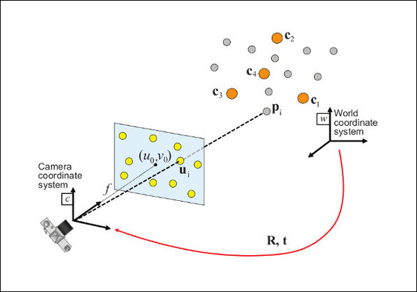
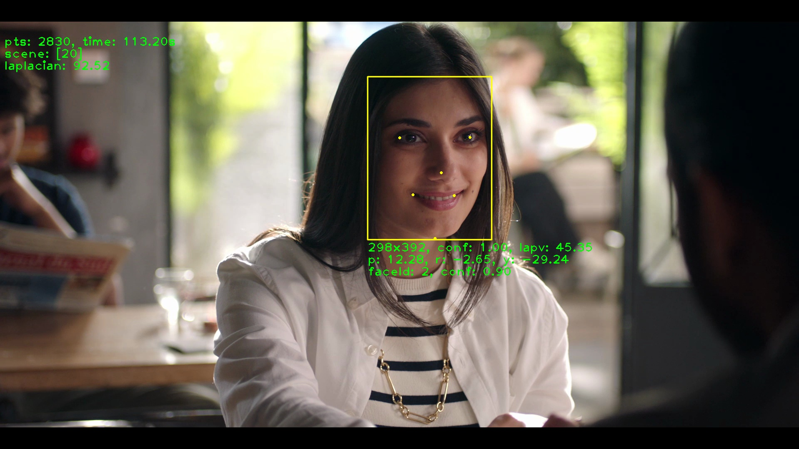

## Contexte et cas d'usage

Aujourd'hui TF1 met à disposition des centaines de milliers de contenus vidéo sur sa plateforme TF1+. La plupart de ces contenus proviennent du catalogue TF1. Depuis peu, certains proviennent de partenaires : TF1+ devient une plateforme d'agrégation. Selon le type de contenu (AVOD, Quotidienne, JT ...) les meta données associées à ces contenus sont plus ou moins bien fournies. L'augmentation en volume de ce catalogue nécessite la mise en place de certaines automatisations afin de garantir la présence de certaines de ces méta données :

* Cue Point : pour déterminer les placements des coupures PUBs
* Thumbnail : pour afficher une vignette, représentative d'un épisode
* Casting : afin que le contenu soit correctement indexé dans le moteur de recherche, que les données de casting soient affichées en front
* Chapitrage : pour identifier les séquences du JT

Ces meta données peuvent être auto générées à partir du contenu vidéo.

## Selection automatique des vignettes vidéo

Dans cet article, nous allons étudier le cas d'usage de la selection automatique des vignettes vidéo (thumbnail). L'idée est de selectionner une frame de la vidéo, qui sera utilisée comme vignette de présentation (thumbnail) dans TF1+. Pour se faire, nous définissons des règles qui vont s'appuyer sur la présence d'un ou plusieurs personnages ainsi que des émotions qu'ils dégagent.

Par exemple :
* personnage principal, calme
* personnage secondaire, souriant
* duo: personnage principal et secondaire, heureux

Pour implémenter ce type de filtrage parmis l'ensemble des frames d'une vidéo, il est nécessaire de mettre en place des outils pour :
* la detection des visages
* la reconnaissance des visages
* l'analyse des émotions

Par ailleur, afin de selectionner le meilleur visuel, il faut également déterminer les caractéristiques précises d'un visage : orientation, yeux ouverts / fermés ...


### AWS Rekognition

AWS Fournit le service [Rekognition](https://aws.amazon.com/fr/rekognition/), qui permet notemment :
* la detection et la reconnaissance de visages
* la detection d'objets
* la detection de CUE Point (placement PUB)

Le service est fiable et donne un niveau de detail assez impressionnant, surtout sur la detection des visages :
* l'orientation du visage (pitch, roll, yaw)
* l'orientation des yeux
* yeux (ouverts / fermés)
* bouche (ouverte / fermée)
* le genre (homme / femme)
* une estimation de l'âge de la personne
* l'émotion de la personne 

La reconnaissance de visage permet d'affecter un identifiant à chaque personne présente dans une vidéo. Il est possible également de rechercher dans une collection d'images indexées des visages d'une même personne.

Le tarif d'AWS rekognition est calculé à la minute de vidéo analysé, il est de 0,10 USD/min pour la detection de visage, soit 6$ pour l'analyse d'une heure de vidéo. Il est également possible d'utiliser le service pour l'analyse d'une seule image, dans ce cas, le tarif est dégressif et commence à 0,001$ pour les opérations de detection, d'indexation et de recherche de visages.

Ci dessous quelques exemples d'analyses d'images avec AWS rekognition :

* Frame extraite du programme "Demain nous appartient" - Camille :



```json
{
  "FaceModelVersion": "7.0",
  "FaceRecords": [
    {
      "Face": {
        "BoundingBox": {
          "Height": 0.36938998,
          "Left": 0.4648164,
          "Top": 0.15837377,
          "Width": 0.14581785
        },
        "Confidence": 99.99991,
        "ExternalImageId": "group20_scene20_frame2830_time_1m53.2s",
        "FaceId": "ea9af6bd-f1b4-460a-86a0-fd32608a8db2",
        "ImageId": "a1bee274-2e8c-378f-9e6b-5ac92e25bdf6",
        "IndexFacesModelVersion": null,
        "UserId": null
      },
      "FaceDetail": {
        "AgeRange": {
          "High": 27,
          "Low": 21
        },
        "Beard": {
          "Confidence": 99.327,
          "Value": false
        },
        "BoundingBox": {
          "Height": 0.36938998,
          "Left": 0.4648164,
          "Top": 0.15837377,
          "Width": 0.14581785
        },
        "Confidence": 99.99991,
        "Emotions": [
          {
            "Confidence": 99.674484,
            "Type": "HAPPY"
          },
          {
            "Confidence": 0.029698014,
            "Type": "SURPRISED"
          },
          {
            "Confidence": 0.024700165,
            "Type": "CALM"
          },
          {
            "Confidence": 0.004152457,
            "Type": "CONFUSED"
          },
          {
            "Confidence": 0.0021755695,
            "Type": "SAD"
          },
          {
            "Confidence": 0.0009357929,
            "Type": "DISGUSTED"
          },
          {
            "Confidence": 0.00067055225,
            "Type": "FEAR"
          },
          {
            "Confidence": 0.00024437904,
            "Type": "ANGRY"
          }
        ],
        "EyeDirection": {
          "Confidence": 99.99743,
          "Pitch": -11.714278,
          "Yaw": 4.179036
        },
        "Eyeglasses": {
          "Confidence": 99.83311,
          "Value": false
        },
        "EyesOpen": {
          "Confidence": 99.94284,
          "Value": true
        },
        "FaceOccluded": {
          "Confidence": 99.72817,
          "Value": false
        },
        "Gender": {
          "Confidence": 99.88475,
          "Value": "Female"
        },
        "Landmarks": [
          {
            "Type": "eyeLeft",
            "X": 0.51439583,
            "Y": 0.3072095
          },
          {
            "Type": "eyeRight",
            "X": 0.58142936,
            "Y": 0.30300102
          },
          {
            "Type": "mouthLeft",
            "X": 0.52031505,
            "Y": 0.4340107
          },
          {
            "Type": "mouthRight",
            "X": 0.5762489,
            "Y": 0.42992982
          },
          {
            "Type": "nose",
            "X": 0.5613297,
            "Y": 0.37382948
          },
          {
            "Type": "leftEyeBrowLeft",
            "X": 0.48439318,
            "Y": 0.2788651
          },
          {
            "Type": "leftEyeBrowRight",
            "X": 0.5327073,
            "Y": 0.2687561
          },
          {
            "Type": "leftEyeBrowUp",
            "X": 0.5108063,
            "Y": 0.26297098
          },
          {
            "Type": "rightEyeBrowLeft",
            "X": 0.57106155,
            "Y": 0.2668129
          },
          {
            "Type": "rightEyeBrowRight",
            "X": 0.60086155,
            "Y": 0.27194983
          },
          {
            "Type": "rightEyeBrowUp",
            "X": 0.5880483,
            "Y": 0.2588775
          },
          {
            "Type": "leftEyeLeft",
            "X": 0.5006436,
            "Y": 0.30724815
          },
          {
            "Type": "leftEyeRight",
            "X": 0.5274707,
            "Y": 0.30748418
          },
          {
            "Type": "leftEyeUp",
            "X": 0.51479876,
            "Y": 0.30083188
          },
          {
            "Type": "leftEyeDown",
            "X": 0.51464856,
            "Y": 0.3128167
          },
          {
            "Type": "rightEyeLeft",
            "X": 0.5679361,
            "Y": 0.30504102
          },
          {
            "Type": "rightEyeRight",
            "X": 0.59146637,
            "Y": 0.30155528
          },
          {
            "Type": "rightEyeUp",
            "X": 0.58209264,
            "Y": 0.29671252
          },
          {
            "Type": "rightEyeDown",
            "X": 0.58103305,
            "Y": 0.3085822
          },
          {
            "Type": "noseLeft",
            "X": 0.54039043,
            "Y": 0.3878802
          },
          {
            "Type": "noseRight",
            "X": 0.5651958,
            "Y": 0.38635063
          },
          {
            "Type": "mouthUp",
            "X": 0.5540638,
            "Y": 0.41727102
          },
          {
            "Type": "mouthDown",
            "X": 0.552262,
            "Y": 0.45527056
          },
          {
            "Type": "leftPupil",
            "X": 0.51439583,
            "Y": 0.3072095
          },
          {
            "Type": "rightPupil",
            "X": 0.58142936,
            "Y": 0.30300102
          },
          {
            "Type": "upperJawlineLeft",
            "X": 0.45368963,
            "Y": 0.30953178
          },
          {
            "Type": "midJawlineLeft",
            "X": 0.47044832,
            "Y": 0.44600865
          },
          {
            "Type": "chinBottom",
            "X": 0.5466232,
            "Y": 0.5203043
          },
          {
            "Type": "midJawlineRight",
            "X": 0.5890297,
            "Y": 0.4391184
          },
          {
            "Type": "upperJawlineRight",
            "X": 0.5997778,
            "Y": 0.30139688
          }
        ],
        "MouthOpen": {
          "Confidence": 88.61521,
          "Value": true
        },
        "Mustache": {
          "Confidence": 99.89976,
          "Value": false
        },
        "Pose": {
          "Pitch": -3.9920487,
          "Roll": -0.19200581,
          "Yaw": 14.684415
        },
        "Quality": {
          "Brightness": 39.181137,
          "Sharpness": 78.6435
        },
        "Smile": {
          "Confidence": 98.989685,
          "Value": true
        },
        "Sunglasses": {
          "Confidence": 99.64001,
          "Value": false
        }
      }
    }
  ],
  "OrientationCorrection": "",
  "UnindexedFaces": [],
  "ResultMetadata": {}
}
```

* Frame extraite du programme "Demain nous appartient" - Simon :


```json
{
  "FaceModelVersion": "7.0",
  "FaceRecords": [
    {
      "Face": {
        "BoundingBox": {
          "Height": 0.5073994,
          "Left": 0.57771593,
          "Top": 0.15709291,
          "Width": 0.1947689
        },
        "Confidence": 99.99969,
        "ExternalImageId": "group9_scene19_frame2757_time_1m50.28s",
        "FaceId": "6b903cf6-3d45-440d-a472-b2ec758b52ad",
        "ImageId": "e43f1ef7-1029-3021-8cb0-bc4a3dc6c50f",
        "IndexFacesModelVersion": null,
        "UserId": null
      },
      "FaceDetail": {
        "AgeRange": {
          "High": 28,
          "Low": 22
        },
        "Beard": {
          "Confidence": 99.83963,
          "Value": true
        },
        "BoundingBox": {
          "Height": 0.5073994,
          "Left": 0.57771593,
          "Top": 0.15709291,
          "Width": 0.1947689
        },
        "Confidence": 99.99969,
        "Emotions": [
          {
            "Confidence": 82.02637,
            "Type": "CALM"
          },
          {
            "Confidence": 3.7963867,
            "Type": "HAPPY"
          },
          {
            "Confidence": 0.8710225,
            "Type": "CONFUSED"
          },
          {
            "Confidence": 0.6752014,
            "Type": "SURPRISED"
          },
          {
            "Confidence": 0.18806458,
            "Type": "SAD"
          },
          {
            "Confidence": 0.09021759,
            "Type": "DISGUSTED"
          },
          {
            "Confidence": 0.03452301,
            "Type": "ANGRY"
          },
          {
            "Confidence": 0.0192523,
            "Type": "FEAR"
          }
        ],
        "EyeDirection": {
          "Confidence": 99.9961,
          "Pitch": -4.282108,
          "Yaw": -41.371216
        },
        "Eyeglasses": {
          "Confidence": 99.346664,
          "Value": false
        },
        "EyesOpen": {
          "Confidence": 99.8771,
          "Value": true
        },
        "FaceOccluded": {
          "Confidence": 99.911705,
          "Value": false
        },
        "Gender": {
          "Confidence": 99.69594,
          "Value": "Male"
        },
        "Landmarks": [
          {
            "Type": "eyeLeft",
            "X": 0.6221226,
            "Y": 0.35962352
          },
          {
            "Type": "eyeRight",
            "X": 0.7024969,
            "Y": 0.37882823
          },
          {
            "Type": "mouthLeft",
            "X": 0.62099516,
            "Y": 0.5224739
          },
          {
            "Type": "mouthRight",
            "X": 0.6880223,
            "Y": 0.53904825
          },
          {
            "Type": "nose",
            "X": 0.64596355,
            "Y": 0.46686035
          },
          {
            "Type": "leftEyeBrowLeft",
            "X": 0.5980547,
            "Y": 0.3112588
          },
          {
            "Type": "leftEyeBrowRight",
            "X": 0.63695276,
            "Y": 0.32009196
          },
          {
            "Type": "leftEyeBrowUp",
            "X": 0.6162148,
            "Y": 0.3041741
          },
          {
            "Type": "rightEyeBrowLeft",
            "X": 0.68303853,
            "Y": 0.3303982
          },
          {
            "Type": "rightEyeBrowRight",
            "X": 0.7381201,
            "Y": 0.34361362
          },
          {
            "Type": "rightEyeBrowUp",
            "X": 0.7091143,
            "Y": 0.3251264
          },
          {
            "Type": "leftEyeLeft",
            "X": 0.6092563,
            "Y": 0.3539567
          },
          {
            "Type": "leftEyeRight",
            "X": 0.63794935,
            "Y": 0.36476493
          },
          {
            "Type": "leftEyeUp",
            "X": 0.62157404,
            "Y": 0.35207558
          },
          {
            "Type": "leftEyeDown",
            "X": 0.62197393,
            "Y": 0.3667092
          },
          {
            "Type": "rightEyeLeft",
            "X": 0.68647975,
            "Y": 0.3762255
          },
          {
            "Type": "rightEyeRight",
            "X": 0.7183587,
            "Y": 0.37976536
          },
          {
            "Type": "rightEyeUp",
            "X": 0.70233184,
            "Y": 0.3711335
          },
          {
            "Type": "rightEyeDown",
            "X": 0.7016881,
            "Y": 0.3856617
          },
          {
            "Type": "noseLeft",
            "X": 0.6371298,
            "Y": 0.47295845
          },
          {
            "Type": "noseRight",
            "X": 0.6670698,
            "Y": 0.47987586
          },
          {
            "Type": "mouthUp",
            "X": 0.64920145,
            "Y": 0.5155665
          },
          {
            "Type": "mouthDown",
            "X": 0.6485316,
            "Y": 0.56190246
          },
          {
            "Type": "leftPupil",
            "X": 0.6221226,
            "Y": 0.35962352
          },
          {
            "Type": "rightPupil",
            "X": 0.7024969,
            "Y": 0.37882823
          },
          {
            "Type": "upperJawlineLeft",
            "X": 0.5927531,
            "Y": 0.3330891
          },
          {
            "Type": "midJawlineLeft",
            "X": 0.598198,
            "Y": 0.5115856
          },
          {
            "Type": "chinBottom",
            "X": 0.6497905,
            "Y": 0.639116
          },
          {
            "Type": "midJawlineRight",
            "X": 0.74155307,
            "Y": 0.5440322
          },
          {
            "Type": "upperJawlineRight",
            "X": 0.7688209,
            "Y": 0.3728635
          }
        ],
        "MouthOpen": {
          "Confidence": 97.98864,
          "Value": false
        },
        "Mustache": {
          "Confidence": 82.85489,
          "Value": true
        },
        "Pose": {
          "Pitch": -0.8480164,
          "Roll": 3.6424594,
          "Yaw": -12.758622
        },
        "Quality": {
          "Brightness": 45.051098,
          "Sharpness": 86.86019
        },
        "Smile": {
          "Confidence": 88.01531,
          "Value": false
        },
        "Sunglasses": {
          "Confidence": 99.46419,
          "Value": false
        }
      }
    }
  ],
  "OrientationCorrection": "",
  "UnindexedFaces": [],
  "ResultMetadata": {}
}
```


### Approche hybride

Afin de réduire les coûts d'AWS rekognition, nous avons adopté une approche hybride utilisant à la fois des outils open source, AWS rekognition et AWS bedrock.


La stratégie est la suivante, les outils open souce permettent un premier filtrage sur les frames afin de ne conserver qu'un nombre réduit de candidats. 
AWS Rekognition est ensuite utilisé, image par image, pour établir un second filtrage, plus fin. Sur les dernieres frames, AWS Bedrock permet l'utilisation d'un LLM multi modal pour selectionner le meilleur visuel en fonction de critères liés au programme de la vidéo.

### Détection de scènes

La detection des scènes permet d'identifier les discontinuitées dans le contenu vidéo, correspondantes a des changement de plan.

L'idée est de limiter le nombre d'analyses par plan, en effet, beaucoup de scènes sont relativement statiques lors de dialogues. Cette affirmation est plus ou moins vérifiée selon le programme, elle est tout a fait pertinante pour des programmes tel que "Ici tout commence", "Demain nous appartient", "Plus belle la vie" et la plupart des quotidiennes de TF1 où les plans sont plutôt statiques et correspondent à une succession de dialogues. C'est un peu moins évidant pour certains programmes comme Koh-Lanta ou les scènes sont plus mouvantes avec des transitions parfois moins marquées. 

Pour une scène donnée, les personnages présents sont en général les mêmes du début à la fin de la scène. Ceci permet de limiter le nombre d'analyse en ne conservant que N candidats par scène tout en conservant l'exhaustivité des plans.
Cela facilite aussi le calcul de temps de présence des personnages, nécessaire pour définir lequel est le personnage principal, secondaire, etc ...

La commande ffmpeg ci dessous permet de détecter les scènes :

```shell
ffmpeg -i video.mp4 -filter:v "select='gt(scène,0.3)',showinfo" -f null -
```


Ici, "0.3" est le seuil de détection des scènes, à ajuster selon le programme.

La commande va générer en sortie d'erreur les logs suivants :


```shell
[Parsed_showinfo_1 @ 0x6000019dc160] n:   0 pts: 548000 pts_time:21.92   duration:   1000 duration_time:0.04    fmt:yuv420p cl:left sar:0/1 s:1920x1080 i:P iskey:0 type:P checksum:4D9D3276 plane_checksum:[214FFDD1 8F8EF20E E0224279] mean:[104 121 130] stdev:[57.2 10.8 7.7]
[Parsed_showinfo_1 @ 0x6000019dc160] n:   1 pts: 709000 pts_time:28.36   duration:   1000 duration_time:0.04    fmt:yuv420p cl:left sar:0/1 s:1920x1080 i:P iskey:0 type:B checksum:1C96B95B plane_checksum:[C829B67C 37D11037 9ED7F299] mean:[98 121 129] stdev:[55.8 11.8 8.5]
[Parsed_showinfo_1 @ 0x6000019dc160] n:   2 pts: 844000 pts_time:33.76   duration:   1000 duration_time:0.04    fmt:yuv420p cl:left sar:0/1 s:1920x1080 i:P iskey:0 type:P checksum:417A4441 plane_checksum:[1FF62C11 4ABACA08 183F4E19] mean:[90 122 132] stdev:[52.1 9.1 8.2]
```

pts_time est la position en seconde dans la vidéo du changement de scène.

La vidéo analysée ici est en 25 frames par secondes (fps) :
duration_time = 1s / 25 = 0.04s

pts_time = (pts * duration_time) / duration

Pour le premier changement de plan (n=0), on obtient :
pts_time = (548000 * 0.04) / 1000 = 21.92s

### Regroupement des scènes similaires

Lors de dialogues, la caméra peut faire des changements répétitifs entre deux personnages qui au final vont correspondre a deux plans qui vont s'alterner. Regrouper les scènes similaires permet de réduire encore un peu plus le nombre d'analyses nécessaires.

Pour se faire, il est possible de comparer la première frame d'une scène avec la dernière frame des scènes précédantes. SSIM (Structural SIMilarity) ou PSNR (Peak Signal to Noise Ratio) sont deux métriques qui permettent de mesurer la similarité entre deux images. 


* les scènes 8 et 10 sont regroupées, il s'agit du même plan sur Camille
* les scènes 9 et 11 sont regroupées, il s'agit du même plan sur Simon

OpenCV permet l'implémentation de ces deux métriques, au delà d'un seuil paramétrable, les deux scène seront regroupées. Un exemple d'implémentation avec OpenCV est disponible [ici](https://docs.opencv.org/4.x/d5/dc4/tutorial_video_input_psnr_ssim.html).

Nos stacks sont développées en Go, il existe un binding Go pour OpenCV : [gocv](https://gocv.io/).

Un exemple d'implémentation de SSIM avec gocv [ici](https://gist.github.com/rpinsonneau/7df55569cf2f784582ce9743286c4ed3).

### Métrique de qualité de l'image

Une fois les scènes détectées et regroupées, il va falloir déterminer une métrique pour conserver les N candidats de chaque groupe de scènes. Le niveau de flou ou de netteté de l'image est un critère important de selection.

Une solution simple pour obtenir cette métrique est de convertir la frame en niveau de gris puis d'appliquer un filtre laplacien. Le filtre laplacien va mettre en évidance les contours des objets, plus l'image est nette plus les contours seront marqués. La variance est une mesure de la dispersion, en calculant celle-ci sur l'image obtenu on obtient un indicateur sur le niveau de détail et de nettetée de l'image : plus la dispersion est importante, plus il y a de contours détaillés plus l'image est nette.



Ci dessous un exemple de code avec gocv pour calculer la variance du filtre laplacien :

```go
func ComputeLaplacianVariance(input gocv.Mat) float64 {

	// convert to grayscale
	grayscale := gocv.NewMat()
	defer grayscale.Close()
	gocv.CvtColor(input, &grayscale, gocv.ColorBGRToGray)

	// compute laplacian from grayscale
	laplacian := gocv.NewMat()
	defer laplacian.Close()
	gocv.Laplacian(grayscale, &laplacian, gocv.MatTypeCV64F, 1, 1, 0, gocv.BorderDefault)

	// compute mean and stddev of laplacian
	mean := gocv.NewMat()
	defer mean.Close()
	stddev := gocv.NewMat()
	defer stddev.Close()
	gocv.MeanStdDev(laplacian, &mean, &stddev)
	variance := math.Pow(float64(stddev.GetDoubleAt(0, 0)), 2)

	return variance
}
```

### Detection des visages

Il existe de multiples algorithmes permettant la detection de visages, ci dessous un tableau récapitulatifs des principaux algorithmes et leur année de publication.

| Algorithme | Description | Support natif OpenCV | Année |
| ---------- | ----------- | -------------- | ----- |
| Haar cascades​ | méthode historique | ✅​ | 2001 |
| dlib-HOG​ | Histogram of Oriented Gradients | ❌​ | 2005​ |
| SSD​ | Single Shot Multibox Detector, permier modèle Deep learning, real time​ | ✅ | 2015 |
| MTCNN​ | Multi-task Cascaded Convolutional Neural Network |​ ❌​ | 2016 |
| DSFD | Dual Shot Face Detector​ | ❌​​ | 2019 |
| RetinaFace​ | InsightFace project | ❌​​ | 2019 |
| MediaPipe​ | Google AI Edge | ❌​​ | 2019 |
| Yunet | CNN-based face detection | ✅​ | 2021 |

Le code OpenCV permettant l'implémentation du modèle Yunet est disponible dans les samples [ici](https://github.com/opencv/opencv/blob/4.x/samples/dnn/face_detect.cpp).

Ce code implémente également la reconnaissance de visage avec sface, qui permet de déterminer la similarité de deux visages.

OpenCV est un framework de traitement d'image complet qui permet l'utilisation de différents modèles. Quelques un de ces modèles DNN (deep neural network) sont disponibles [ici](https://github.com/opencv/opencv_zoo) et donnent un aperçu de ce qu'il est possible de faire avec OpenCV.

Ci dessous un exemple d'implémentation avec gocv de detection de visage avec Yunet.

```go
package opencv

import (
	_ "embed"
	"image"

	"github.com/rpinsonneau/scène-detect/internal/model"
	"gocv.io/x/gocv"
)

var (
	//go:embed onnx/face_detection_yunet_2023mar.onnx
	FaceDetectionYunet2023mar []byte
)

type YunetFaceDetector struct {
	fd *gocv.FaceDetectorYN
}

func NewYunetFaceDetector() (FaceDetector, error) {

	file, err := writeTempFile(FaceDetectionYunet2023mar, "face_detection_yunet_2023mar*.onnx")
	if err != nil {
		return nil, err
	}

	fd := gocv.NewFaceDetectorYN(file, "", image.Pt(320, 320))

	return &YunetFaceDetector{
		fd: &fd,
	}, nil
}

func (fd *YunetFaceDetector) DetectFaces(input gocv.Mat, confidence float32) ([]*model.Face, error) {

	fd.fd.SetInputSize(image.Pt(input.Cols(), input.Rows()))
	output := gocv.NewMat()
	defer output.Close()
	fd.fd.Detect(input, &output)

	var faces []*model.Face
	for i := 0; i < output.Rows(); i++ {
		face := model.NewFace(
			image.Rect(
				int(output.GetFloatAt(i, 0)),
				int(output.GetFloatAt(i, 1)),
				int(output.GetFloatAt(i, 0))+int(output.GetFloatAt(i, 2)),
				int(output.GetFloatAt(i, 1))+int(output.GetFloatAt(i, 3)),
			),
			output.GetFloatAt(i, 14),
			SourceOCV,
		)

		// face landmarks
		face.SetRightEye(image.Pt(int(output.GetFloatAt(i, 4)), int(output.GetFloatAt(i, 5))))
		face.SetLeftEye(image.Pt(int(output.GetFloatAt(i, 6)), int(output.GetFloatAt(i, 7))))
		face.SetNose(image.Pt(int(output.GetFloatAt(i, 8)), int(output.GetFloatAt(i, 9))))
		face.SetRightMouthCorner(image.Pt(int(output.GetFloatAt(i, 10)), int(output.GetFloatAt(i, 11))))
		face.SetLeftMouthCorner(image.Pt(int(output.GetFloatAt(i, 12)), int(output.GetFloatAt(i, 13))))

		if !face.Rectangle().Empty() && isRoiInImage(input, face) {
			faces = append(faces, face)
		}

	}

	return faces, nil
}

func (fd *YunetFaceDetector) Close() {
	fd.fd.Close()
}

```

Le résultat de la detection est stocké dans une matrice, il faut donc récupérer les différents indices de chaque ligne pour récupérer la zone de détection (x, y, largeur, hauteur) et les landmarks (yeux, nez, bouche).

Les landmarks sont des points d'intêret permettant de pointer les coordonnées de certaines parties du visage (yeux, nez, bouche, menton).



Le modèle Yunet remonte 5 landmarks, d'autre modèles permettent de remonter 68 landmarks avec [FacemarkLBF](https://docs.opencv.org/4.10.0/dc/d63/classcv_1_1face_1_1FacemarkLBF.html).


### Estimation de l'orientation du visage

OpenCV met à disposition une fonction [solvePnP](https://docs.opencv.org/4.x/d5/d1f/calib3d_solvePnP.html) qui permet à partir d'une projection sur un plan 2d de déterminer les matrices de translation et de rotation déterminant la position de l'objet 3d dans le monde réel.



Pour cela la fonction prend plusieurs éléments en entrée :
* 6 points, projetés sur le plan 2d, il s'agit ici des positions des landmarks
* un modèle 3d de visage avec les 6 points correspondants aux landmarks
* les paramètres de la camera, tel que la focale

En toute rigueur, le modèle 3d de chaque personne est unique. Cependant, un modèle générique est suffisant pour estimer l'orientation de n'importe quel visage.

De même, les paramètres de la camera, notemment la focale, vont influencer sur cette estimation, cependant, des valeurs par défaut sont suffisantes pour une estimation.

Ci-dessous un exemple de code avec gocv :

```go
		// 2d face landmarks
		faceLandmarks := gocv.NewPoint2fVectorFromPoints([]gocv.Point2f{
			{
				X: float32(face.GetNose().X),
				Y: float32(face.GetNose().Y),
			},
			{
				X: float32(face.GetChin().X),
				Y: float32(face.GetChin().Y),
			},
			{
				X: float32(face.GetLeftEye().X),
				Y: float32(face.GetLeftEye().Y),
			},
			{
				X: float32(face.GetRightEye().X),
				Y: float32(face.GetRightEye().Y),
			},
			{
				X: float32(face.GetLeftMouthCorner().X),
				Y: float32(face.GetLeftMouthCorner().Y),
			},
			{
				X: float32(face.GetRightMouthCorner().X),
				Y: float32(face.GetRightMouthCorner().Y),
			},
		})
		defer faceLandmarks.Close()

		// 3d face model
		model := gocv.NewPoint3fVectorFromPoints([]gocv.Point3f{
			{X: 0.0, Y: 0.0, Z: 0.0},          // Nose tip
			{X: 0.0, Y: -330.0, Z: -65.0},     // Chin
			{X: -225.0, Y: 170.0, Z: -135.0},  // Left eye left corner
			{X: 225.0, Y: 170.0, Z: -135.0},   // Right eye right corner
			{X: -150.0, Y: -150.0, Z: -125.0}, // Left Mouth corner
			{X: 150.0, Y: -150.0, Z: -125.0},  // Right mouth corner
		})
		defer model.Close()

		// camera matrix
		focalLength := input.Cols() // Approximate focal length.
		center := image.Pt(input.Cols()/2, input.Rows()/2)
		cameraMatrix := gocv.NewMatWithSize(3, 3, gocv.MatTypeCV64F)
		defer cameraMatrix.Close()

		cameraMatrix.SetDoubleAt(0, 0, float64(focalLength))
		cameraMatrix.SetDoubleAt(0, 1, 0)
		cameraMatrix.SetDoubleAt(0, 2, float64(center.X))
		cameraMatrix.SetDoubleAt(1, 0, 0)
		cameraMatrix.SetDoubleAt(1, 1, float64(focalLength))
		cameraMatrix.SetDoubleAt(1, 2, float64(center.Y))
		cameraMatrix.SetDoubleAt(2, 0, 0)
		cameraMatrix.SetDoubleAt(2, 1, 0)
		cameraMatrix.SetDoubleAt(2, 2, 1)

		// dist_coeffs
		dist_coeffs := gocv.NewMatWithSize(4, 1, gocv.MatTypeCV64F)
		defer dist_coeffs.Close()

		// rotation and translation vectors
		rotation := gocv.NewMat()
		defer rotation.Close()
		translation := gocv.NewMat()
		defer translation.Close()

		// Perspective-n-Point (PnP) pose computation
		gocv.SolvePnP(model, faceLandmarks, cameraMatrix, dist_coeffs, &rotation, &translation, false, 0)

		// convert rotation vector to euler angles
		r := gocv.NewMat()
		defer r.Close()
		gocv.Rodrigues(rotation, &r)
		sy := math.Sqrt(r.GetDoubleAt(0, 0)*r.GetDoubleAt(0, 0) + r.GetDoubleAt(1, 0)*r.GetDoubleAt(1, 0))
		singular := sy < 1e-6
		var x, y, z float64
		if !singular {
			x = math.Atan2(r.GetDoubleAt(2, 1), r.GetDoubleAt(2, 2))
			y = math.Atan2(-r.GetDoubleAt(2, 0), sy)
			z = math.Atan2(r.GetDoubleAt(1, 0), r.GetDoubleAt(0, 0))
		} else {
			x = math.Atan2(-r.GetDoubleAt(1, 2), r.GetDoubleAt(1, 1))
			y = math.Atan2(-r.GetDoubleAt(2, 0), sy)
			z = 0
		}

		face.Pitch = x * 180 / math.Pi
		face.Yaw = y * 180 / math.Pi
		face.Roll = z * 180 / math.Pi
```
Etant donnée qu'il faut 6 points minimum en entrée de la fonction solvePnP, les 5 landmarks du modèle Yunet ne sont pas suffisants pour l'estimation de la position du visage.

Ci-dessous, la detection du visage de Camille avec l'estimation de son orientation :




### Scoring des frames

Plusieurs niveaux de filtrage sont opérés à l'echelle de chaque regroupement de scène.

Le premier niveau de filtrage s'appuit sur l'analyse avec opencv. Une fonction de scoring permet de ne garder que N frames pour chaque groupe. Cette fonction s'appuit sur les éléments suivants :
* la proportion des visages sur l'ecran
* la variance du filtre laplacien (sur l'image globale et sur les zones de détection des visages).
* le niveau de confiance de detection des visages
* l'estimation de l'orientation du visage

En effet, le seuil de confiance de detection est un indicateur important. Un visage partiellement occulté ou trop orienté sur un côté aura un niveau de confiance plus faible étant donnée sa detection plus difficile et donc moins fiable.

Sur ce premier filtrage, nous conservons une selection de quelques frames par regroupement de scène, avec un écart minimum entre chaque candidat.

Le second niveau de filtrage s'effectue après l'analyse avec AWS Rekognition et s'appuit sur un scoring sur les éléments suivants :
* taille et orientation du visage
* ouverture et orientation des yeux
* bouche fermée ou un sourire
* l'émotion de la personne

### Reconnaissance de visages

AWS Rekognition permet la reconnaissance de visage. Pour cela il est possible de créer une collection dans laquelle nous allons indexer des visages.

Création de la collection :
```go
_, err := r.client.CreateCollection(ctx, &rekognition.CreateCollectionInput{
  CollectionId: aws.String(r.collectionId),
})
if err != nil {
  panic(err)
}
```

Indexation des visages d'une image
```go
  facesIndex, err := r.client.IndexFaces(ctx, &rekognition.IndexFacesInput{
    CollectionId:    aws.String(r.collectionId),
    ExternalImageId: aws.String(screenshot.FrameContext.String()),
    Image: &types.Image{
      Bytes: bs,
    },
    DetectionAttributes: []types.Attribute{
      types.AttributeAll,
    },
  })
  if err != nil {
    panic(err)
  }
```
L'indexation renvoit les même attributs que la detection, il n'est donc pas nécessaire de faire deux opérations.

Recherche des visages similaire dans la collection
```go
  search, err := r.client.SearchFaces(ctx, &rekognition.SearchFacesInput{
    CollectionId:       aws.String(r.collectionId),
    FaceId:             fr.Face.FaceId,
    FaceMatchThreshold: aws.Float32(float32(r.cfg.FaceRecognitionMinimumSimilarity)),
  })
  if err != nil {
    panic(err)
  }
```

L'attribut FaceId doit être valorisé avec la valeur renseignée en sortie de l'indexation.

Exemple de retour de la recherche :

```json
{
  "FaceMatches": [
    {
      "Face": {
        "BoundingBox": {
          "Height": 0.373889,
          "Left": 0.498104,
          "Top": 0.145949,
          "Width": 0.145449
        },
        "Confidence": 99.999794,
        "ExternalImageId": "group20_scene20_frame2937_time_1m57.48s",
        "FaceId": "ba911e94-7c3c-42b6-b693-23544b0244c9",
        "ImageId": "355f918f-5989-379a-b786-e48d6c7639e7",
        "IndexFacesModelVersion": "7.0",
        "UserId": null
      },
      "Similarity": 99.99992
    },
    {
      "Face": {
        "BoundingBox": {
          "Height": 0.3824,
          "Left": 0.374953,
          "Top": 0.157578,
          "Width": 0.13977
        },
        "Confidence": 99.9996,
        "ExternalImageId": "group14_scene18_frame2544_time_1m41.76s",
        "FaceId": "aca9dc5b-511f-40b7-8dcc-489f2ac270a5",
        "ImageId": "f5ca90f5-7a1c-34b9-b84a-419487068b31",
        "IndexFacesModelVersion": "7.0",
        "UserId": null
      },
      "Similarity": 99.999916
    },
    {
      "Face": {
        "BoundingBox": {
          "Height": 0.376234,
          "Left": 0.380485,
          "Top": 0.183655,
          "Width": 0.139851
        },
        "Confidence": 99.9997,
        "ExternalImageId": "group14_scene18_frame2755_time_1m50.2s",
        "FaceId": "217252ee-5c12-4673-82f4-9e01a8b105d6",
        "ImageId": "369d85f9-df06-32d9-a058-58ddc7d131b5",
        "IndexFacesModelVersion": "7.0",
        "UserId": null
      },
      "Similarity": 99.99988
    },
    {
      "Face": {
        "BoundingBox": {
          "Height": 0.370737,
          "Left": 0.386591,
          "Top": 0.219342,
          "Width": 0.139286
        },
        "Confidence": 99.9995,
        "ExternalImageId": "group6_scene10_frame1404_time_56.16s",
        "FaceId": "73e18d27-85b2-4bc7-8783-fabf8026800e",
        "ImageId": "f8a7a759-6de3-3b8d-a617-8b5aee085a70",
        "IndexFacesModelVersion": "7.0",
        "UserId": null
      },
      "Similarity": 99.999855
    },
    {
      "Face": {
        "BoundingBox": {
          "Height": 0.377166,
          "Left": 0.352541,
          "Top": 0.194139,
          "Width": 0.142679
        },
        "Confidence": 99.9997,
        "ExternalImageId": "group6_scene10_frame1508_time_1m0.32s",
        "FaceId": "03a10069-5a08-4a50-88bc-38bbf0bd3873",
        "ImageId": "7f1e63ff-43b9-3547-bb67-b4f80551d7e6",
        "IndexFacesModelVersion": "7.0",
        "UserId": null
      },
      "Similarity": 99.99984
    },
    {
      "Face": {
        "BoundingBox": {
          "Height": 0.362563,
          "Left": 0.366831,
          "Top": 0.223855,
          "Width": 0.138061
        },
        "Confidence": 99.9996,
        "ExternalImageId": "group14_scene14_frame2223_time_1m28.92s",
        "FaceId": "986f1195-cd09-4629-b871-2969cf303ac6",
        "ImageId": "8a2dd6ed-7962-367a-a529-f669a9ce2466",
        "IndexFacesModelVersion": "7.0",
        "UserId": null
      },
      "Similarity": 99.99983
    },
    {
      "Face": {
        "BoundingBox": {
          "Height": 0.240159,
          "Left": 0.356472,
          "Top": 0.16679,
          "Width": 0.0923306
        },
        "Confidence": 99.9981,
        "ExternalImageId": "group4_scene4_frame754_time_30.16s",
        "FaceId": "dbf8d851-8797-42db-8b18-751b25625341",
        "ImageId": "1b6d980d-f87a-3880-acf9-9af934cf198c",
        "IndexFacesModelVersion": "7.0",
        "UserId": null
      },
      "Similarity": 99.99966
    },
    {
      "Face": {
        "BoundingBox": {
          "Height": 0.36427,
          "Left": 0.382736,
          "Top": 0.16512,
          "Width": 0.136051
        },
        "Confidence": 99.9995,
        "ExternalImageId": "group14_scene16_frame2379_time_1m35.16s",
        "FaceId": "80771ee0-1004-4b22-8b22-7af281825e00",
        "ImageId": "c17b121e-bbd2-3816-a66c-c6b2b53c68a1",
        "IndexFacesModelVersion": "7.0",
        "UserId": null
      },
      "Similarity": 99.99955
    },
    {
      "Face": {
        "BoundingBox": {
          "Height": 0.361178,
          "Left": 0.335164,
          "Top": 0.228363,
          "Width": 0.138493
        },
        "Confidence": 99.9995,
        "ExternalImageId": "group6_scene12_frame1616_time_1m4.64s",
        "FaceId": "48358db9-b6c3-4fb4-a301-7660a47ab407",
        "ImageId": "f793c441-6656-3f99-b828-5389ee01274a",
        "IndexFacesModelVersion": "7.0",
        "UserId": null
      },
      "Similarity": 99.99922
    },
    {
      "Face": {
        "BoundingBox": {
          "Height": 0.371159,
          "Left": 0.394839,
          "Top": 0.245917,
          "Width": 0.142968
        },
        "Confidence": 99.999794,
        "ExternalImageId": "group6_scene8_frame1186_time_47.44s",
        "FaceId": "6e6b4eaf-a36d-45f1-8c3c-ccb5953d5070",
        "ImageId": "27ca9e96-22af-363d-a895-9af98a113593",
        "IndexFacesModelVersion": "7.0",
        "UserId": null
      },
      "Similarity": 99.99922
    },
    {
      "Face": {
        "BoundingBox": {
          "Height": 0.353885,
          "Left": 0.366461,
          "Top": 0.194141,
          "Width": 0.137903
        },
        "Confidence": 99.9995,
        "ExternalImageId": "group6_scene12_frame1774_time_1m10.96s",
        "FaceId": "c9b5c82f-6a40-48a5-92dc-14efb047a263",
        "ImageId": "2ae4c96a-66ac-3e80-9b2d-be0e900a25d1",
        "IndexFacesModelVersion": "7.0",
        "UserId": null
      },
      "Similarity": 99.99917
    },
    {
      "Face": {
        "BoundingBox": {
          "Height": 0.374631,
          "Left": 0.407712,
          "Top": 0.172038,
          "Width": 0.145586
        },
        "Confidence": 99.9997,
        "ExternalImageId": "group6_scene6_frame988_time_39.52s",
        "FaceId": "c5f9365a-c91b-46eb-aa0b-ce776ba0d101",
        "ImageId": "632dc19d-3414-3f67-955d-94b27fa50a8e",
        "IndexFacesModelVersion": "7.0",
        "UserId": null
      },
      "Similarity": 99.99867
    },
    {
      "Face": {
        "BoundingBox": {
          "Height": 0.234199,
          "Left": 0.357588,
          "Top": 0.123309,
          "Width": 0.084453
        },
        "Confidence": 99.995705,
        "ExternalImageId": "group4_scene4_frame465_time_18.6s",
        "FaceId": "4607a885-ff86-4587-866c-682583ab0e3c",
        "ImageId": "68472b0a-b22e-3c0d-afd9-90ac5de79903",
        "IndexFacesModelVersion": "7.0",
        "UserId": null
      },
      "Similarity": 99.99801
    },
    {
      "Face": {
        "BoundingBox": {
          "Height": 0.224203,
          "Left": 0.387475,
          "Top": 0.130461,
          "Width": 0.0792494
        },
        "Confidence": 99.996,
        "ExternalImageId": "group1_scene2_frame321_time_12.84s",
        "FaceId": "701109c1-f551-458a-bd28-58637a5f9abf",
        "ImageId": "df598cd4-46d6-3755-a430-19b47e608ddb",
        "IndexFacesModelVersion": "7.0",
        "UserId": null
      },
      "Similarity": 99.99028
    },
    {
      "Face": {
        "BoundingBox": {
          "Height": 0.35406,
          "Left": 0.548117,
          "Top": 0.18813,
          "Width": 0.12966
        },
        "Confidence": 99.9853,
        "ExternalImageId": "group1_scene2_frame148_time_5.92s",
        "FaceId": "41094fbc-c88f-43a6-b951-2cc838488970",
        "ImageId": "ecc29d7a-df74-36f0-8d8f-2817371a0c23",
        "IndexFacesModelVersion": "7.0",
        "UserId": null
      },
      "Similarity": 88.80459
    }
  ],
  "FaceModelVersion": "7.0",
  "SearchedFaceId": "ea9af6bd-f1b4-460a-86a0-fd32608a8db2",
  "ResultMetadata": {}
}
```
La reconnaisance de visage permet d'itentifier les groupes de scène dans lesquels un même personnage apparaît. Pour cela il n'est pas nécessaire d'avoir une base de connaissance des personnages. Il suffit de déterminer les clusters de visages avec un algorithme KNN et d'utiliser le score de similarité de rekognition comme distance.

Une fois les personnages associés aux groupes de scène, il est aisé de déterminer la durée d'apparition de chaque personnage et de déterminer le personnage principal ou secondaire.

### Selection de la meilleure frame

Une fois le filtrage avec OpenCV et l'analyse des frames restantes avec rekognition effectués, nous avons les informations suivantes :
* la durée d'apparition de chaque personnage
* pour chaque personnage, l'ensemble des frames analysées où il apparaît
* un scoring pour chaque frames s'appuyant sur les caractéristiques du visage

Il est donc possible par exemple de selectionner les N meilleurs frames pour un critère tel que : "personnage secondaire, calme".

Afin de faire la dernière selection parmis ces N derniers candidats, nous pourvons utiliser un LLM multi modal.

AWS bedrock permet l'inférence de différents modèles en SAS. Claude Haiku, un modèle d'Anthropic est un modèle multi modal. Cela signifie qu'en plus du prompt, il est possible de soumettre en entrée des images. Le modèle peut interpréter celles-ci et donner des informations selon le prompt associé.

Ci-dessous un exemple d'utilisation d'AWS bedrock avec Claude Haiku.

```go
package bedrock

import (
	"context"
	"encoding/base64"
	"encoding/json"
	"fmt"
	"os"
	"path/filepath"
	"strings"

	"github.com/aws/aws-sdk-go-v2/config"
	"github.com/aws/aws-sdk-go-v2/service/bedrockruntime"
	"github.com/aws/aws-sdk-go/aws"
	"github.com/rpinsonneau/scène-detect/internal/report"
)

type BedrockAnalysis struct {
	client     *bedrockruntime.Client
	reportPath string
}

type Request struct {
	AnthropicVersion string     `json:"anthropic_version"`
	MaxTokens        int        `json:"max_tokens"`
	Temperature      float64    `json:"temperature"`
	System           string     `json:"system"`
	Messages         []Messages `json:"messages"`
}
type Source struct {
	Type      string `json:"type"`
	MediaType string `json:"media_type"`
	Data      string `json:"data"`
}
type Content struct {
	Type   string  `json:"type"`
	Source *Source `json:"source,omitempty"`
	Text   *string `json:"text,omitempty"`
}
type Messages struct {
	Role    string    `json:"role"`
	Content []Content `json:"content"`
}

type Response struct {
	ID         string    `json:"id"`
	Type       string    `json:"type"`
	Role       string    `json:"role"`
	Model      string    `json:"model"`
	Usage      Usage     `json:"usage"`
	Content    []Content `json:"content"`
	StopReason string    `json:"stop_reason"`
}
type Usage struct {
	InputTokens  int `json:"input_tokens"`
	OutputTokens int `json:"output_tokens"`
}

type Image struct {
	Image   string  `json:"image"`
	Score   float64 `json:"score"`
	Explain string  `json:"explain"`
	Select  bool    `json:"select"`
}

func NewBedrockAnalysis(ctx context.Context, reportPath string) *BedrockAnalysis {
	return &BedrockAnalysis{
		client:     createClient(ctx),
		reportPath: reportPath,
	}
}

func createClient(ctx context.Context) *bedrockruntime.Client {
	// Load the Shared AWS Configuration (~/.aws/config)
	cfg, err := config.LoadDefaultConfig(ctx,
		config.WithSharedConfigProfile("etf1-sandbox"),
		config.WithRegion("eu-west-3"),
	)
	if err != nil {
		panic(err)
	}

	// rekognition client
	return bedrockruntime.NewFromConfig(cfg)
}

func toMessageContent(file string) ([]Content, error) {

	// read file bytes
	raw, err := os.ReadFile(file)
	if err != nil {
		return nil, err
	}

	// encode to base64
	base64Content := base64.StdEncoding.EncodeToString(raw)

	return []Content{
		{
			Type: "text",
			Text: aws.String(fmt.Sprintf("\"%s\":", filepath.Base(file))),
		},
		{
			Type: "image",
			Source: &Source{
				Type:      "base64",
				MediaType: "image/jpeg",
				Data:      base64Content,
			},
		},
	}, nil

}

func (b *BedrockAnalysis) Analyze(ctx context.Context) {

	// prepare anthropic haiku request
	request := &Request{
		AnthropicVersion: "bedrock-2023-05-31",
		MaxTokens:        4096,
		Temperature:      0.7,
		System: "Vous êtes un membre de l'équipe éditoriale du site de streaming vidéo TF1+." +
			" Votre mission est de noter des images qui serviront de thumbnail afin de mettre en avant une vidéo du catalogue de TF1+." +
			" Vous évalurez la qualité de la composition de l'image ainsi que l'émotion transmise par les personnages." +
			" Vous répondrez en JSON dans un tableau qui comportera les clés suivantes:" +
			" \"image\" (le nom de l'image)," +
			" \"score\" (votre notation de l'image en pourcentage)," +
			" \"explain\" (une explication de votre notation)",
		Messages: []Messages{
			{
				Role: "user",
				Content: []Content{
					{
						Type: "text",
						Text: aws.String("Ci-dessous, une série d'images extraites d'une vidéo."),
					},
				},
			},
			{
				Role: "assistant",
				Content: []Content{
					{
						Type: "text",
						Text: aws.String("[{\"image\": \""),
					},
				},
			},
		},
	}

	// search thumbnails candidates
	thumbnailsDirectory := filepath.Join(b.reportPath, report.THUMBNAILS_DIR)
	entries, err := os.ReadDir(thumbnailsDirectory)
	if err != nil {
		panic(err)
	}

	for _, entry := range entries {
		if entry.IsDir() {
			continue
		}
		if !strings.HasSuffix(entry.Name(), ".jpg") {
			continue
		}

		// load thumbnail into message content
		file := filepath.Join(thumbnailsDirectory, entry.Name())
		content, err := toMessageContent(file)
		if err != nil {
			panic(err)
		}
		request.Messages[0].Content = append(request.Messages[0].Content, content...)
	}

	// marshal request
	body, err := json.Marshal(request)
	if err != nil {
		panic(err)
	}

	// invoke model
	output, err := b.client.InvokeModel(ctx, &bedrockruntime.InvokeModelInput{
		ModelId: aws.String("anthropic.claude-3-haiku-20240307-v1:0"),
		Body:    body,
	})
	if err != nil {
		panic(err)
	}

	fmt.Println(string(output.Body))

	// unmarshal response
	response := &Response{}
	err = json.Unmarshal(output.Body, response)
	if err != nil {
		panic(err)
	}

	text := "[{\"image\": \""
	for _, content := range response.Content {
		if content.Type != "text" || content.Text == nil {
			continue
		}
		text += *content.Text
	}

	analysis := make([]Image, 0)
	err = json.Unmarshal([]byte(text), &analysis)
	if err != nil {
		panic(err)
	}

	// print indent json
	raw, err := json.MarshalIndent(analysis, "", "  ")
	if err != nil {
		panic(err)
	}
	fmt.Println(string(raw))

	err = os.WriteFile(filepath.Join(b.reportPath, "bedrock_analysis.json"), raw, os.ModePerm)
	if err != nil {
		panic(err)
	}

}
```

Et le retour du modèle sur les frames selectionnées de Camille et Simon :

```json
[
  {
    "image": "1_character1_1m17.76s.jpg",
    "score": 90,
    "explain": "Cette image présente une femme souriante avec des cheveux noirs qui regarde directement la caméra. L'éclairage est doux et met en valeur son visage, créant une atmosphère chaleureuse. La composition de l'image est équilibrée et attire l'attention sur l'expression de la personne, transmettant une émotion positive.",
    "select": false
  },
  {
    "image": "2_character0_39.76s.jpg",
    "score": 85,
    "explain": "Cette image montre un homme au regard intense et sérieux, dans un environnement sombre et mystérieux. La lumière éclaire son visage de manière dramatique, créant une ambiance tendue et captivante. La composition met l'accent sur l'expression du personnage, transmettant une émotion de réflexion ou de concentration.",
    "select": false
  }
]
```

Le prompt donné en exemple n'est pas très précis sur les critères de selection. Il est nécessaire de l'affiner selon le contexte du programme pour un filtrage plus selectif.

## Conclusion

L'approche hybride nous permet de réduire par trois la facture AWS Rekognition sans impacter de façon structurante la qualité de l'analyse. OpenCV est framework complet, bien qu'il soit complexe de s'y retrouver dans la quantitée de modèles disponibles. La detection de visage est fiable, la reconnaissance de visage est encore perfectible sur les modèles open source disponibles. AWS rekognition reste à ce jour beaucoup plus performant notamment sur cet aspect. L'utilisation d'un LLM multi modal permet d'affiner d'avantage la selection.

Le use case de selection automatique des vignette couvre un ensemble varié d'outils : 
* détection de scène avec ffmpeg
* similarité des plans avec SSIM
* détection et reconnaissance des visages avec OpenCV (Yunet et SFace) ainsi que AWS Rekognition
* analyse d'une image avec un LLM multi modal avec AWS Bedrock

La mise en place des ces outils nous ont permis de gagner en expertise sur le domaine "computer vision". 

Ces même outils nous permettent d'adresser différents cas d'usage notamment sur le chapitrage ou la détection du casting. De cette façon nous pouvons capitaliser sur ces outils en interne et ne pas dépendre d'une solution externe pour chaque usage.
